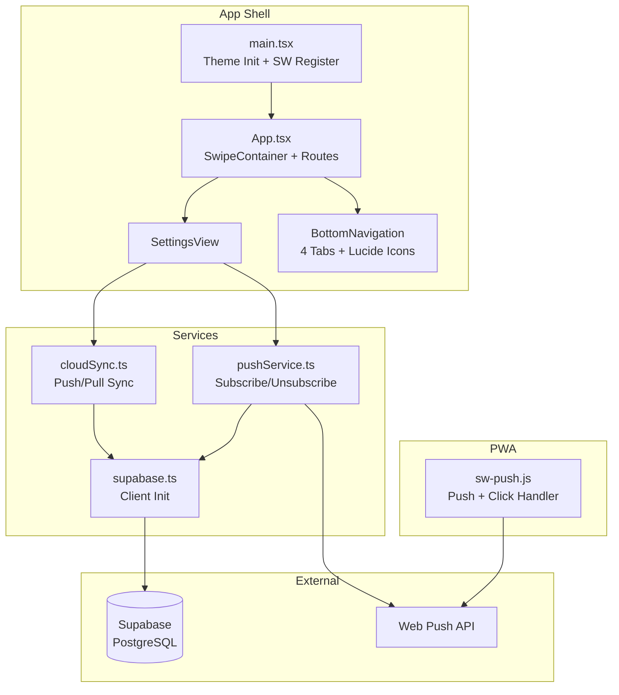
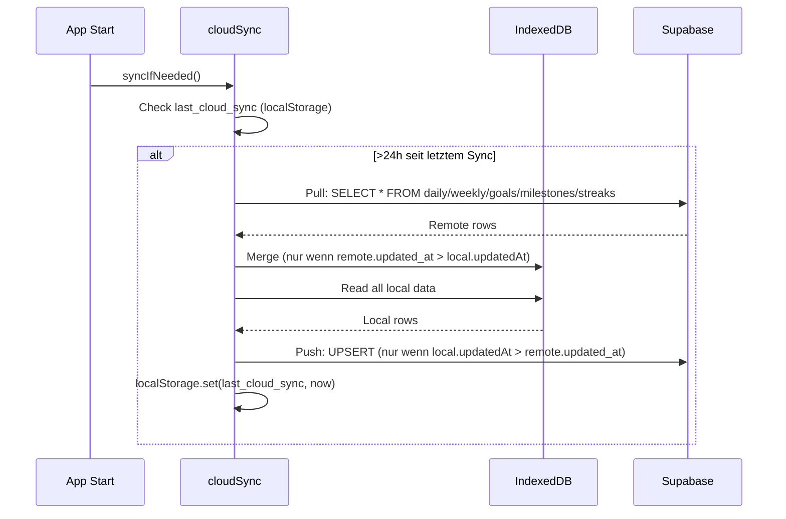
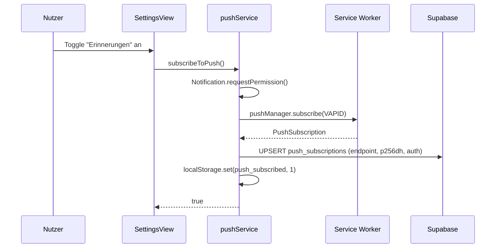

# Design-Dokument: Cloud, Settings & Infrastruktur

## Übersicht

Dieses Modul ergänzt die Fitness Tracker PWA um Cloud-Synchronisation (Supabase), serverseitige Web Push Notifications, eine zentrale Einstellungsseite, Theme-Umschaltung und Swipe-Navigation. Alle Komponenten sind bereits implementiert und produktiv.

### Technologie-Stack (Ergänzungen)

| Komponente | Technologie | Begründung |
|---|---|---|
| Cloud Backend | Supabase (PostgreSQL + REST API) | Kostenloser Tier, einfache REST API, Row-Level Security möglich |
| Push Notifications | Web Push API + VAPID | Standardkonform, kein eigener Push-Server nötig |
| Icons | Lucide React | Leichtgewichtig, Tree-Shakeable, konsistente Icons |

### Designentscheidungen

- **Device-basierte Sync statt User-Auth**: Kein Login erforderlich — jedes Gerät bekommt eine UUID, Daten werden pro Device getrennt in Supabase gespeichert
- **"Newer wins" Strategie**: Kein komplexes Conflict-Resolution — der neuere `updatedAt` Timestamp gewinnt immer
- **Pull-then-Push**: Beim Sync wird zuerst von Remote geladen, dann lokal gepusht — verhindert Datenverlust bei gleichzeitigen Änderungen
- **24h Sync-Intervall**: Sync wird nur ausgelöst wenn die letzte Synchronisation >24h her ist — spart API-Calls
- **VAPID Push ohne eigenen Server**: Push-Subscriptions werden in Supabase gespeichert, ein externer Cron/Edge-Function kann Notifications triggern
- **Theme vor Render**: Der gespeicherte Theme-Modus wird in `main.tsx` vor `createRoot()` angewendet, um Flash-of-Wrong-Theme zu vermeiden

## Architektur



### Datenfluss: Cloud Sync



### Datenfluss: Push Subscription



## Komponenten und Schnittstellen

### Supabase Client

```typescript
// src/services/supabase.ts
import { createClient } from '@supabase/supabase-js'
export const supabase = createClient(SUPABASE_URL, SUPABASE_ANON_KEY)
```

### Cloud Sync Service

```typescript
// src/services/cloudSync.ts
interface SyncBehavior {
  syncInterval: 24 * 60 * 60 * 1000  // 24h
  strategy: 'newer-wins'              // updatedAt comparison
  order: 'pull-then-push'             // pull first to avoid data loss
  deviceId: string                     // UUID from localStorage
}

export async function syncIfNeeded(): Promise<void>
// Intern: pushToCloud(deviceId), pullFromCloud(deviceId)
```

Synchronisierte Tabellen:
| Lokal (IndexedDB) | Remote (Supabase) | Conflict Key |
|---|---|---|
| dailyMeasurements | daily_measurements | device_id, date |
| weeklyMeasurements | weekly_measurements | device_id, date |
| goals | goals | device_id, id |
| milestones | milestones | device_id, id |
| streaks | streaks | device_id |

### Push Service

```typescript
// src/services/pushService.ts
export async function subscribeToPush(): Promise<boolean>
export async function unsubscribeFromPush(): Promise<void>
export async function isPushSubscribed(): Promise<boolean>
```

### Service Worker Push Handler

```typescript
// public/sw-push.js
// Listeners: 'push' (show notification), 'notificationclick' (open app)
// Notification options: body, icon, badge, tag, data.url
```

### Settings View

```typescript
// src/views/SettingsView.tsx
// Sektionen:
// 1. Fitbit — Verbinden/Trennen/Sync
// 2. Daten — Export/Import (JSON)
// 3. Erscheinungsbild — Theme-Tabs (System/Hell/Dunkel)
// 4. Benachrichtigungen — Push-Toggle
```

### Theme Manager

```typescript
// In main.tsx (vor Render):
const savedTheme = localStorage.getItem('theme_mode')
if (savedTheme === 'light' || savedTheme === 'dark') {
  document.documentElement.setAttribute('data-mode', savedTheme)
}

// In SettingsView (Runtime):
// System → html.removeAttribute('data-mode')
// Light  → html.setAttribute('data-mode', 'light')
// Dark   → html.setAttribute('data-mode', 'dark')
```

### Swipe Navigation

```typescript
// In App.tsx — SwipeContainer Component
const SWIPE_ROUTES = ['/', '/daily', '/weekly', '/settings']
const SWIPE_THRESHOLD = 50 // px

// Touch-Erkennung:
// - Horizontal > Vertikal * 0.7 → Swipe
// - deltaX < -50 → nächste Route
// - deltaX > +50 → vorherige Route
// - Nur auf SWIPE_ROUTES aktiv
```

### Bottom Navigation

```typescript
// src/components/BottomNavigation.tsx
// 4 Tabs: Dashboard (ChartLine), Täglich (Scale), Wöchentlich (RulerDimensionLine), Mehr (Settings)
// Lucide React Icons, sr-only Labels
// Active: data-material="inverted", data-container-contrast="max"
// Inactive: data-material="transparent"
```

## Supabase Tabellen-Schema

```sql
-- daily_measurements
CREATE TABLE daily_measurements (
  device_id TEXT NOT NULL,
  date TEXT NOT NULL,
  weight REAL,
  body_fat REAL,
  source TEXT NOT NULL,
  updated_at TEXT NOT NULL,
  PRIMARY KEY (device_id, date)
);

-- weekly_measurements
CREATE TABLE weekly_measurements (
  device_id TEXT NOT NULL,
  date TEXT NOT NULL,
  chest REAL, waist REAL, hip REAL,
  belly REAL, upper_arm REAL, thigh REAL,
  updated_at TEXT NOT NULL,
  PRIMARY KEY (device_id, date)
);

-- goals
CREATE TABLE goals (
  device_id TEXT NOT NULL,
  id TEXT NOT NULL,
  metric_type TEXT NOT NULL,
  zone TEXT,
  start_value REAL NOT NULL,
  target_value REAL NOT NULL,
  deadline TEXT,
  created_at TEXT NOT NULL,
  status TEXT NOT NULL,
  reached_at TEXT,
  updated_at TEXT NOT NULL,
  PRIMARY KEY (device_id, id)
);

-- milestones
CREATE TABLE milestones (
  device_id TEXT NOT NULL,
  id TEXT NOT NULL,
  type TEXT NOT NULL,
  label TEXT NOT NULL,
  earned_at TEXT NOT NULL,
  notified BOOLEAN NOT NULL DEFAULT FALSE,
  PRIMARY KEY (device_id, id)
);

-- streaks
CREATE TABLE streaks (
  device_id TEXT PRIMARY KEY,
  daily_streak INTEGER NOT NULL DEFAULT 0,
  daily_last_date TEXT,
  weekly_streak INTEGER NOT NULL DEFAULT 0,
  weekly_last_date TEXT,
  updated_at TEXT NOT NULL
);

-- push_subscriptions
CREATE TABLE push_subscriptions (
  endpoint TEXT PRIMARY KEY,
  p256dh TEXT,
  auth TEXT,
  created_at TEXT NOT NULL
);
```

## Fehlerbehandlung

| Kategorie | Behandlung |
|---|---|
| Sync-Fehler (Netzwerk) | Console.error, App funktioniert normal weiter mit lokalen Daten |
| Push-Permission verweigert | `subscribeToPush()` gibt `false` zurück, UI zeigt Toggle als aus |
| Ungültige Remote-Daten | `try/catch` pro Row, ungültige Einträge werden übersprungen |
| Service Worker nicht verfügbar | Push-Features graceful degraded, `isPushSubscribed()` gibt `false` zurück |
| Import-Fehler | Temporäre Statusmeldung in SettingsView (3s sichtbar) |
