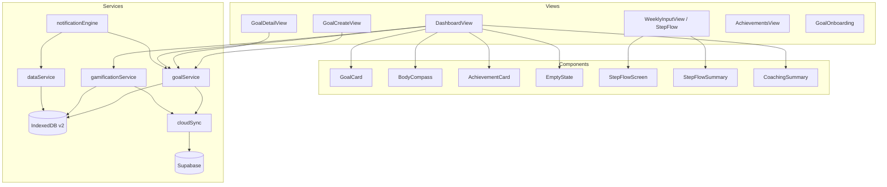
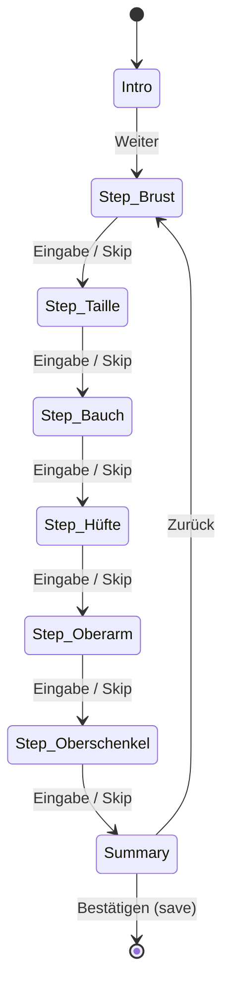

# Design Document: Coaching, Goals & Gamification

## Overview

This design adds a coaching, goal-tracking, and gamification layer to the existing fitness tracking PWA. The feature is structured in three phases:

- **Phase 1**: Goal system (CRUD, projections, persistence, sync), upgraded notifications (emotional + context-aware), dashboard empty states
- **Phase 2**: Step-by-step circumference measurement flow replacing the current single-form `WeeklyInputView`, weekly comparison with feedback
- **Phase 3**: Streaks, milestones, consistency score, non-scale victories, dashboard coaching summary, achievement cards, goal onboarding

The system integrates with the existing IndexedDB + Supabase sync architecture, follows the DB UX Design System conventions (`.adaptive`, CSS variables, `data-interactive`, etc.), and renders all UI in German.

### Key Design Decisions

1. **New services are pure logic modules** — `goalService.ts`, `gamificationService.ts`, and `notificationEngine.ts` contain no UI code and are independently testable.
2. **IndexedDB schema version bump to 2** — adds `goals`, `streaks`, and `milestones` object stores via the `idb` upgrade handler.
3. **Step flow uses local component state** — the wizard is a single React component with a `step` index, not a router-level multi-page flow. This avoids polluting the URL and keeps swipe navigation intact.
4. **Projection engine is a pure function** — takes measurement arrays and goal config, returns projection data. No side effects.
5. **Notification engine wraps existing notification service** — replaces static message strings with pool-based selection, adding context detection on top.

## Architecture



### Routing Changes

New routes added to `App.tsx`:

| Route | Component | Purpose |
|---|---|---|
| `/goals/new` | `GoalCreateView` | Goal creation form |
| `/goals/:id` | `GoalDetailView` | Goal detail + progress |
| `/achievements` | `AchievementsView` | Milestones & streaks list |
| `/onboarding` | `GoalOnboarding` | First-use guided setup |

The existing `/weekly` route keeps `WeeklyInputView` but the component is refactored internally to use the step-by-step flow. The `SWIPE_ROUTES` array remains `['/', '/daily', '/weekly', '/settings']` — goal and achievement routes are accessed via taps, not swipe.

## Components and Interfaces

### Service Layer

#### goalService.ts

```typescript
// CRUD
createGoal(input: GoalInput): Promise<Goal>
getGoal(id: string): Promise<Goal | undefined>
getAllGoals(): Promise<Goal[]>
getActiveGoals(): Promise<Goal[]>
updateGoalStatus(id: string, status: GoalStatus): Promise<void>
deleteGoal(id: string): Promise<void>

// Projection
calculateProjection(goal: Goal, measurements: DailyMeasurement[] | WeeklyMeasurement[]): GoalProjection

// Lifecycle — called after each measurement save
evaluateGoals(measurements: DailyMeasurement[], weeklyMeasurements: WeeklyMeasurement[]): Promise<GoalEvaluation[]>
```

#### gamificationService.ts

```typescript
// Streaks
updateDailyStreak(date: string): Promise<StreakInfo>
updateWeeklyStreak(weekStart: string): Promise<StreakInfo>
getStreaks(): Promise<Streaks>

// Milestones
evaluateMilestones(context: MilestoneContext): Promise<Milestone[]>
getEarnedMilestones(): Promise<Milestone[]>

// Consistency
calculateConsistencyScore(weekStart: string, dailyMeasurements: DailyMeasurement[], hasWeeklyMeasurement: boolean): ConsistencyScore

// Non-Scale Victories
detectNonScaleVictories(dailyMeasurements: DailyMeasurement[], weeklyMeasurements: WeeklyMeasurement[]): NonScaleVictory[]
```

#### notificationEngine.ts

```typescript
// Replaces static messages in notificationService.ts
getDailyReminderMessage(context: UserContext): string
getWeeklyReminderMessage(context: UserContext): string
categorizeUserContext(dailyMeasurements: DailyMeasurement[], goals: Goal[]): UserContextState
```

### UI Components

#### StepFlowScreen

Single measurement input screen within the step-by-step wizard. Props:

```typescript
interface StepFlowScreenProps {
  zone: CircumferenceZone
  label: string
  hint: string           // measurement tip text
  value: string
  onChange: (value: string) => void
  onNext: () => void
  onSkip: () => void
  error?: string
  stepIndex: number
  totalSteps: number
}
```

#### StepFlowSummary

Summary screen after all steps. Props:

```typescript
interface StepFlowSummaryProps {
  entries: StepFlowEntry[]
  previousWeek: WeeklyMeasurement | undefined
  onConfirm: () => void
  onBack: () => void
}
```

#### GoalCard

Compact goal status display for dashboard. Props:

```typescript
interface GoalCardProps {
  goal: Goal
  projection: GoalProjection | null
  onClick: () => void
}
```

#### BodyCompass

Directional trend indicator for circumference zones. Props:

```typescript
interface BodyCompassProps {
  trends: Record<CircumferenceZone, TrendDirection | null>
}
```

#### EmptyState

Reusable empty state with CTA. Props:

```typescript
interface EmptyStateProps {
  icon: React.ReactNode
  message: string
  ctaLabel: string
  onCtaClick: () => void
}
```

#### AchievementCard

Milestone/streak display card. Props:

```typescript
interface AchievementCardProps {
  achievement: Milestone | StreakAchievement
  onClick?: () => void
}
```

#### CoachingSummary

Dashboard coaching header card. Props:

```typescript
interface CoachingSummaryProps {
  currentWeight: number | null
  weeklyWeightChange: number | null
  activeGoal: Goal | null
  projection: GoalProjection | null
}
```

## Data Models

### New Types (added to `src/types/index.ts`)

```typescript
/** Metric types that can be tracked as goals */
export type GoalMetricType = 'weight' | 'bodyFat' | 'circumference'

/** Circumference zone identifiers */
export type CircumferenceZone = 'chest' | 'waist' | 'hip' | 'belly' | 'upperArm' | 'thigh'

/** Goal lifecycle status */
export type GoalStatus = 'active' | 'reached' | 'archived'

/** User context state for notification engine */
export type UserContextState = 'progressing' | 'consistent' | 'stagnating' | 'inactive'

/** Trend direction for body compass */
export type TrendDirection = 'improving' | 'stable' | 'declining'

/** A user-defined fitness goal */
export interface Goal {
  /** UUID primary key */
  id: string
  /** Which metric this goal tracks */
  metricType: GoalMetricType
  /** Circumference zone, required when metricType is 'circumference' */
  zone?: CircumferenceZone
  /** Value at goal creation */
  startValue: number
  /** Target value to reach */
  targetValue: number
  /** Optional deadline date (YYYY-MM-DD) */
  deadline?: string
  /** ISO 8601 timestamp of creation */
  createdAt: string
  /** Goal lifecycle status */
  status: GoalStatus
  /** ISO 8601 timestamp when goal was reached, if applicable */
  reachedAt?: string
  /** ISO 8601 timestamp of last update */
  updatedAt: string
}

/** Input for creating a new goal (id, createdAt, status, updatedAt are generated) */
export interface GoalInput {
  metricType: GoalMetricType
  zone?: CircumferenceZone
  startValue: number
  targetValue: number
  deadline?: string
}

/** Projection data calculated by the goal projection engine */
export interface GoalProjection {
  /** Current measured value */
  currentValue: number
  /** Absolute distance remaining to target */
  remainingDistance: number
  /** Percentage of goal completed (0-100) */
  percentComplete: number
  /** Required weekly change to hit deadline (null if no deadline) */
  requiredWeeklyTempo: number | null
  /** Projected completion date based on current rate (null if insufficient data) */
  projectedDate: string | null
  /** Current weekly rate of change (weighted moving average of last 4 weeks) */
  currentWeeklyRate: number | null
  /** Trend feedback category */
  trendFeedback: 'ahead' | 'on-track' | 'behind' | 'insufficient-data'
}

/** Result of evaluating a goal against current measurements */
export interface GoalEvaluation {
  goalId: string
  previousStatus: GoalStatus
  newStatus: GoalStatus
  justReached: boolean
}

/** Streak tracking data */
export interface Streaks {
  /** Consecutive days with a weight measurement */
  dailyStreak: number
  /** Date of last daily measurement (YYYY-MM-DD) */
  dailyLastDate: string | null
  /** Consecutive weeks with a circumference measurement */
  weeklyStreak: number
  /** Week start date of last weekly measurement (YYYY-MM-DD) */
  weeklyLastDate: string | null
  /** ISO 8601 timestamp */
  updatedAt: string
}

/** Info returned after a streak update */
export interface StreakInfo {
  currentStreak: number
  isNewRecord: boolean
  thresholdReached: number | null  // e.g., 7, 30, etc. or null
}

/** A recorded milestone achievement */
export interface Milestone {
  /** UUID primary key */
  id: string
  /** Machine-readable milestone type */
  type: MilestoneType
  /** German display label */
  label: string
  /** Date earned (YYYY-MM-DD) */
  earnedAt: string
  /** Whether the user has been notified */
  notified: boolean
}

/** Known milestone types */
export type MilestoneType =
  | 'first-goal-reached'
  | 'weight-loss-5kg'
  | 'daily-streak-10'
  | 'daily-streak-30'
  | 'weekly-streak-4'
  | 'weekly-streak-12'

/** Context passed to milestone evaluation */
export interface MilestoneContext {
  goals: Goal[]
  streaks: Streaks
  dailyMeasurements: DailyMeasurement[]
  earnedMilestones: Milestone[]
}

/** Weekly consistency score */
export interface ConsistencyScore {
  /** Week start date (YYYY-MM-DD) */
  weekStart: string
  /** Number of days with weight logged (0-7) */
  daysLogged: number
  /** Whether weekly circumference was completed */
  weeklyCompleted: boolean
  /** Final score 0-100 */
  score: number
}

/** A detected non-scale victory */
export interface NonScaleVictory {
  /** German message describing the victory */
  message: string
  /** Which metric improved */
  metric: string
  /** Date detected */
  detectedAt: string
}

/** User context for notification message selection */
export interface UserContext {
  state: UserContextState
  currentDailyStreak: number
  hasActiveGoal: boolean
  lastNotificationPhrase?: string
}

/** Entry in the step flow wizard */
export interface StepFlowEntry {
  zone: CircumferenceZone
  label: string
  value: number | null
  skipped: boolean
}

/** Streak achievement for display purposes */
export interface StreakAchievement {
  type: 'daily-streak' | 'weekly-streak'
  count: number
  label: string
}
```

### IndexedDB Schema Changes

The database version bumps from `1` to `2`. The `upgrade` handler in `db.ts` adds three new object stores:

```typescript
export interface FitnessTrackerDB extends DBSchema {
  // ... existing stores unchanged ...

  goals: {
    key: string          // goal.id (UUID)
    value: Goal
    indexes: {
      'by-status': GoalStatus
      'by-createdAt': string
    }
  }
  streaks: {
    key: string          // singleton key: 'current'
    value: Streaks
  }
  milestones: {
    key: string          // milestone.id (UUID)
    value: Milestone
    indexes: {
      'by-type': MilestoneType
      'by-earnedAt': string
    }
  }
}
```

Upgrade handler addition:

```typescript
upgrade(db, oldVersion) {
  if (oldVersion < 1) {
    // existing v1 setup...
  }
  if (oldVersion < 2) {
    const goalStore = db.createObjectStore('goals', { keyPath: 'id' })
    goalStore.createIndex('by-status', 'status')
    goalStore.createIndex('by-createdAt', 'createdAt')

    db.createObjectStore('streaks')

    const milestoneStore = db.createObjectStore('milestones', { keyPath: 'id' })
    milestoneStore.createIndex('by-type', 'type')
    milestoneStore.createIndex('by-earnedAt', 'earnedAt')
  }
}
```

### Supabase Table Schemas

Three new tables, following the existing `device_id` + `updated_at` pattern from `daily_measurements` / `weekly_measurements`:

```sql
-- Goals
CREATE TABLE goals (
  device_id TEXT NOT NULL,
  id UUID NOT NULL,
  metric_type TEXT NOT NULL,
  zone TEXT,
  start_value NUMERIC NOT NULL,
  target_value NUMERIC NOT NULL,
  deadline DATE,
  created_at TIMESTAMPTZ NOT NULL,
  status TEXT NOT NULL DEFAULT 'active',
  reached_at TIMESTAMPTZ,
  updated_at TIMESTAMPTZ NOT NULL,
  PRIMARY KEY (device_id, id)
);

-- Milestones
CREATE TABLE milestones (
  device_id TEXT NOT NULL,
  id UUID NOT NULL,
  type TEXT NOT NULL,
  label TEXT NOT NULL,
  earned_at DATE NOT NULL,
  notified BOOLEAN NOT NULL DEFAULT false,
  PRIMARY KEY (device_id, id)
);

-- Streaks (one row per device)
CREATE TABLE streaks (
  device_id TEXT PRIMARY KEY,
  daily_streak INTEGER NOT NULL DEFAULT 0,
  daily_last_date DATE,
  weekly_streak INTEGER NOT NULL DEFAULT 0,
  weekly_last_date DATE,
  updated_at TIMESTAMPTZ NOT NULL
);
```

The `cloudSync.ts` `pushToCloud` and `pullFromCloud` functions are extended with loops for `goals`, `milestones`, and `streaks` following the same "only overwrite if newer" pattern.

### Goal Projection Engine Algorithm

The projection engine is a pure function: `calculateProjection(goal, measurements) → GoalProjection`.

**Algorithm:**

1. **Extract relevant values**: Filter measurements to the goal's metric type (and zone for circumference). Sort by date ascending.
2. **Current value**: Take the most recent measurement value.
3. **Remaining distance**: `|targetValue - currentValue|`
4. **Percent complete**: `(|startValue - currentValue| / |startValue - targetValue|) * 100`, clamped to 0–100.
5. **Current weekly rate** (requires ≥3 data points spanning ≥7 days):
   - Group measurements into calendar weeks.
   - Compute weekly deltas for the most recent 4 weeks (or fewer if less data).
   - Apply weighted moving average: weights `[0.4, 0.3, 0.2, 0.1]` for most-recent to oldest.
   - Result is the average weekly change (negative for decreasing metrics).
6. **Projected date** (requires currentWeeklyRate ≠ 0):
   - `weeksRemaining = remainingDistance / |currentWeeklyRate|`
   - `projectedDate = today + weeksRemaining * 7 days`
7. **Required weekly tempo** (requires deadline):
   - `weeksUntilDeadline = (deadline - today) / 7`
   - `requiredWeeklyTempo = remainingDistance / weeksUntilDeadline`
8. **Trend feedback**:
   - If insufficient data → `'insufficient-data'`
   - If no deadline → based on whether currentWeeklyRate is moving toward target
   - If projectedDate ≤ deadline → `'ahead'`
   - If projectedDate is within 1 week of deadline → `'on-track'`
   - If projectedDate > deadline → `'behind'`

### Notification Message Pools

The notification engine maintains two pools of German phrases, plus context-specific overlays:

**Daily reminder pool (≥10 phrases):**
```
"Kurz auf die Waage — du weißt, es lohnt sich."
"Ein kleiner Schritt heute: Gewicht eintragen."
"Dein Körper erzählt eine Geschichte — hör kurz rein."
"Nur eine Zahl, aber sie zählt. Trag sie ein."
"Guten Abend! Hast du heute schon gewogen?"
"Dranbleiben ist der Schlüssel. Schnell eintragen?"
"Dein zukünftiges Ich wird dir danken. Waage?"
"Routine macht den Unterschied. Kurz wiegen?"
"Kleine Gewohnheit, große Wirkung. Gewicht?"
"Hey! Dein täglicher Check-in wartet."
```

**Weekly reminder pool (≥10 phrases):**
```
"Zeit für deine Umfänge — das geht schnell!"
"Einmal messen, eine Woche lang gut fühlen."
"Deine Maße erzählen mehr als die Waage."
"Sonntag ist Messtag! Maßband bereit?"
"Kurzer Umfang-Check — du schaffst das in 2 Minuten."
"Die Woche abrunden: Umfänge eintragen."
"Dein Körper verändert sich — halt es fest!"
"Maßband-Moment: Wie sieht's diese Woche aus?"
"Umfänge messen = Fortschritt sichtbar machen."
"Letzte Aufgabe der Woche: Messen!"
```

**Context overlays** (prepended or substituted based on `UserContextState`):

| State | Example overlay |
|---|---|
| `progressing` | "Du machst echte Fortschritte! Weiter so." |
| `consistent` | "7 Tage am Stück — starke Routine!" |
| `stagnating` | "Plateau? Kein Stress — dein Körper passt sich an." |
| `inactive` | "Schon eine Weile her — ein kurzer Check-in reicht." |

**Rotation logic**: Store the index of the last used phrase per pool in `localStorage`. Increment modulo pool length. Never repeat the immediately previous phrase.

### Step-by-Step Flow State Machine



State is managed as a single `step: number` (0 = intro, 1–6 = zones, 7 = summary). Each step screen validates on "next" and allows "skip". The summary screen shows all entries with weekly comparison deltas. "Bestätigen" saves via `saveWeeklyMeasurement()`.

### Dashboard Coaching Layout

The enhanced dashboard adds a coaching section above the existing graph tabs:

```
┌─────────────────────────────┐
│  CoachingSummary             │  ← current weight, 7d change, goal status
│  (or EmptyState if no data) │
├─────────────────────────────┤
│  GoalCard (active goal)     │  ← compact: progress bar, tempo, trend
│  (or EmptyState if no goal) │
├─────────────────────────────┤
│  BodyCompass                 │  ← trend arrows per zone
│  (or EmptyState if no weekly)│
├─────────────────────────────┤
│  AchievementCards (up to 3) │  ← recent milestones/streaks
├─────────────────────────────┤
│  [Existing graph tabs]       │
│  [Existing graph + controls] │
└─────────────────────────────┘
```

Each section conditionally renders an `EmptyState` component when data is missing, with a German CTA that navigates to the relevant input view.

### Consistency Score Calculation

Formula: `score = (daysLogged / 7) * 70 + (weeklyCompleted ? 30 : 0)`

- `daysLogged`: count of days in the calendar week (Mon–Sun) that have a `DailyMeasurement` record
- `weeklyCompleted`: boolean, true if a `WeeklyMeasurement` exists for that week's Monday
- Result is a number 0–100, displayed as percentage

### Non-Scale Victory Detection

After each measurement save, check:

1. **Circumference drop with stable weight**: If weight change over 14 days < 0.3 kg AND any circumference zone decreased > 0.5 cm → generate NSV message for that zone
2. **Body fat drop**: If body fat decreased > 0.5% over 14 days regardless of weight → generate NSV message

Both checks use the most recent 14 days of data. Messages are generated in German with the specific metric named.

### Weekly Comparison Logic

The `StepFlowSummary` compares each entered value against the previous week's `WeeklyMeasurement`:

- **Decrease** (diff < −0.3 cm): Show green delta + positive phrase (e.g., "Starker Fortschritt!")
- **Stable** (−0.3 ≤ diff ≤ +0.3 cm): Show neutral delta
- **Increase** (diff > +0.3 cm): Show neutral delta (no negative language)
- **No previous data**: Show "Erster Eintrag"

If ALL entered values are stable or increased, show a global encouraging message: "Dranbleiben — Veränderung braucht Zeit."


## Correctness Properties

*A property is a characteristic or behavior that should hold true across all valid executions of a system — essentially, a formal statement about what the system should do. Properties serve as the bridge between human-readable specifications and machine-verifiable correctness guarantees.*

### Property 1: Goal serialization round-trip

*For any* valid `Goal` object, serializing it to JSON and then deserializing the JSON string back should produce an object deeply equal to the original.

**Validates: Requirements 4.4, 4.5**

### Property 2: Goal persistence round-trip

*For any* valid `GoalInput`, after calling `createGoal` and then `getGoal` with the returned id, the retrieved goal should have matching `metricType`, `zone`, `startValue`, `targetValue`, `deadline`, and `status === 'active'`.

**Validates: Requirements 1.5**

### Property 3: Goal start value from most recent measurement

*For any* non-empty array of `DailyMeasurement` records sorted by date and a goal metric type of `'weight'`, the start value recorded by `createGoal` should equal the `weight` value of the measurement with the latest date. The same applies for `'bodyFat'` and for `'circumference'` with the corresponding zone field from `WeeklyMeasurement`.

**Validates: Requirements 1.3**

### Property 4: Target must differ from start

*For any* `GoalInput` where `targetValue === startValue`, calling `createGoal` should throw a validation error and not persist any record.

**Validates: Requirements 1.6**

### Property 5: Required weekly tempo calculation

*For any* active goal with a deadline and at least 2 measurement data points, `requiredWeeklyTempo` should equal `remainingDistance / weeksUntilDeadline` where `weeksUntilDeadline = (deadline - today) / 7` and `remainingDistance = |targetValue - currentValue|`.

**Validates: Requirements 2.2**

### Property 6: Projected completion date existence

*For any* active goal with at least 3 measurement data points spanning at least 7 days, `calculateProjection` should return a non-null `projectedDate` and a non-null `currentWeeklyRate`.

**Validates: Requirements 2.3**

### Property 7: Trend feedback correctness

*For any* goal projection where both `projectedDate` and `deadline` are non-null: if `projectedDate <= deadline` then `trendFeedback` should be `'ahead'` or `'on-track'`; if `projectedDate > deadline` then `trendFeedback` should be `'behind'`.

**Validates: Requirements 2.4, 2.5**

### Property 8: Goal completion detection

*For any* active goal and any new measurement where the current value meets or passes the target value (i.e., for a "lose weight" goal: `currentValue <= targetValue`), `evaluateGoals` should return a `GoalEvaluation` with `newStatus === 'reached'` and `justReached === true`.

**Validates: Requirements 3.1**

### Property 9: Step flow zone ordering

*For any* step index `i` in range [0, 5], the zone displayed at step `i + 1` (1-indexed, after intro) should match the predefined order: `['chest', 'waist', 'belly', 'hip', 'upperArm', 'thigh']`.

**Validates: Requirements 5.2**

### Property 10: Step flow produces correct WeeklyMeasurement

*For any* set of `StepFlowEntry` values (some entered, some skipped), confirming the summary should produce a `WeeklyMeasurement` where each zone field equals the entered value or `undefined` if skipped, and the `date` equals the current week's Monday.

**Validates: Requirements 5.5, 5.7**

### Property 11: Weekly comparison classification

*For any* current circumference value and previous circumference value, the difference classification should follow: if `diff < -0.3` then `'decrease'`, if `diff > 0.3` then `'increase'`, otherwise `'stable'`. When all zones are classified as `'stable'` or `'increase'`, the global feedback should be the encouraging message.

**Validates: Requirements 6.1, 6.3, 6.4, 6.5**

### Property 12: Notification messages come from pool

*For any* `UserContext`, calling `getDailyReminderMessage` should return a string that is a member of the daily phrase pool, and calling `getWeeklyReminderMessage` should return a string that is a member of the weekly phrase pool.

**Validates: Requirements 7.1, 7.2**

### Property 13: Notification phrase non-repetition

*For any* two consecutive calls to `getDailyReminderMessage` (or `getWeeklyReminderMessage`) with the same context, the returned phrases should not be identical.

**Validates: Requirements 7.4**

### Property 14: User context categorization

*For any* set of daily measurements and active goals: if the user has logged every day for the past 7 days, the state should be `'consistent'`; if the most recent measurement shows progress toward a goal, the state should be `'progressing'`; if no measurement exists for 3+ days, the state should be `'inactive'`; if weight change over 14 days is < 0.2 kg, the state should be `'stagnating'`.

**Validates: Requirements 8.1, 8.2, 8.3, 8.4, 8.5**

### Property 15: Context-appropriate notification selection

*For any* `UserContext` with a given `state`, the message returned by the notification engine should match the corresponding context overlay pool (praise for `'consistent'`, progress-acknowledging for `'progressing'`, reactivation for `'inactive'`, plateau-motivating for `'stagnating'`).

**Validates: Requirements 8.1, 8.2, 8.3, 8.4**

### Property 16: Body compass trend calculation

*For any* circumference zone with at least 3 weekly measurements, the trend direction should be: `'improving'` if the values are decreasing over the 3 measurements, `'declining'` if increasing, `'stable'` otherwise. For zones with fewer than 3 measurements, the trend should be `null`.

**Validates: Requirements 10.3, 10.4**

### Property 17: Streak count correctness

*For any* sequence of daily measurement dates, the daily streak should equal the length of the longest consecutive-day suffix ending at the most recent date. Similarly, for any sequence of weekly measurement week-start dates, the weekly streak should equal the length of the longest consecutive-week suffix.

**Validates: Requirements 11.1, 11.2, 11.3, 11.4**

### Property 18: Streak threshold detection

*For any* streak count, `thresholdReached` should be non-null if and only if the count equals one of the notable thresholds (7, 30 for daily; 4, 12 for weekly).

**Validates: Requirements 11.5**

### Property 19: First goal reached milestone

*For any* milestone context where exactly one goal has `status === 'reached'` and no `'first-goal-reached'` milestone exists in `earnedMilestones`, `evaluateMilestones` should return a milestone with `type === 'first-goal-reached'`.

**Validates: Requirements 12.1**

### Property 20: Cumulative weight loss milestone

*For any* milestone context where the sum of `(startValue - currentValue)` across all weight goals with progress ≥ 5.0 kg and no `'weight-loss-5kg'` milestone exists, `evaluateMilestones` should return a milestone with `type === 'weight-loss-5kg'`.

**Validates: Requirements 12.2**

### Property 21: Daily streak 10 milestone

*For any* milestone context where `streaks.dailyStreak >= 10` and no `'daily-streak-10'` milestone exists, `evaluateMilestones` should return a milestone with `type === 'daily-streak-10'`.

**Validates: Requirements 12.3**

### Property 22: Milestone notified flag

*For any* milestone, after it has been displayed as a notification once, the `notified` field should be `true`, and subsequent calls to get unnotified milestones should not include it.

**Validates: Requirements 12.5**

### Property 23: Consistency score formula

*For any* `daysLogged` in [0, 7] and `weeklyCompleted` boolean, the consistency score should equal `Math.round((daysLogged / 7) * 70 + (weeklyCompleted ? 30 : 0))` and be in the range [0, 100].

**Validates: Requirements 13.1, 13.2**

### Property 24: Non-scale victory — circumference drop with stable weight

*For any* 14-day measurement window where the absolute weight change is < 0.3 kg and at least one circumference zone has decreased by > 0.5 cm, `detectNonScaleVictories` should return at least one `NonScaleVictory` referencing that zone.

**Validates: Requirements 14.1**

### Property 25: Non-scale victory — body fat drop

*For any* 14-day measurement window where body fat has decreased by > 0.5% (regardless of weight change), `detectNonScaleVictories` should return at least one `NonScaleVictory` referencing body fat.

**Validates: Requirements 14.2**

### Property 26: Achievement display limit and recency ordering

*For any* list of earned milestones and streak achievements, the dashboard should display at most 3, and they should be the 3 most recently earned (sorted by `earnedAt` descending).

**Validates: Requirements 16.1, 16.2**

## Error Handling

| Scenario | Handling |
|---|---|
| IndexedDB upgrade failure (v1→v2) | Catch in `getDB()`, log error, fall back to read-only mode for existing stores. New feature sections show "Datenbank-Update erforderlich" empty state. |
| Goal creation with invalid input | `createGoal` throws with descriptive error. UI displays German validation message inline. |
| Projection with insufficient data | `calculateProjection` returns `trendFeedback: 'insufficient-data'`, null for `projectedDate` and `currentWeeklyRate`. UI shows "Noch nicht genug Daten für eine Prognose." |
| Supabase sync failure for new tables | Same pattern as existing sync: `catch` block logs error, sync retries on next cycle. Local data remains authoritative. |
| Step flow validation error | Individual step shows inline error below input. User cannot advance until corrected or skips. |
| Notification permission denied | `notificationEngine` functions still compute messages (for in-app display) but skip `new Notification()` calls. |
| Milestone evaluation error | Catch per-milestone, log, continue evaluating remaining milestones. Partial results are acceptable. |
| Empty measurement arrays passed to gamification functions | All functions handle empty arrays gracefully: streaks return 0, consistency returns 0, NSV returns empty array, projections return insufficient-data. |

## Testing Strategy

### Property-Based Testing

Use **fast-check** as the property-based testing library (TypeScript/JavaScript ecosystem, works with Vitest).

Each correctness property (Properties 1–26) is implemented as a single `fc.assert(fc.property(...))` test with a minimum of 100 iterations.

Each test is tagged with a comment:
```typescript
// Feature: coaching-goals-gamification, Property 1: Goal serialization round-trip
```

Key generators needed:
- `arbitraryGoal()`: generates valid `Goal` objects with random metric types, zones, values within range, valid dates
- `arbitraryGoalInput()`: generates valid `GoalInput` objects
- `arbitraryDailyMeasurement()`: generates valid `DailyMeasurement` with weight/bodyFat in range
- `arbitraryWeeklyMeasurement()`: generates valid `WeeklyMeasurement` with circumference values in range
- `arbitraryDailySequence(n)`: generates a sorted sequence of n daily measurements with consecutive or gapped dates
- `arbitraryWeeklySequence(n)`: generates a sorted sequence of n weekly measurements
- `arbitraryUserContext()`: generates `UserContext` with valid state combinations
- `arbitraryStepFlowEntries()`: generates 6 `StepFlowEntry` items with random entered/skipped states

### Unit Testing

Unit tests (Vitest) cover:
- Specific examples for goal creation (happy path with each metric type)
- Edge cases: goal with no deadline, goal with circumference zone, empty measurement arrays
- Integration: step flow save produces correct `WeeklyMeasurement` record
- Empty state rendering: dashboard with no data shows correct CTAs
- Onboarding trigger conditions
- Notification pool size verification (≥10 each)
- Milestone deduplication (already-earned milestones not re-triggered)

### Test Organization

```
src/
  services/__tests__/
    goalService.test.ts          # Properties 1-8, unit tests
    gamificationService.test.ts  # Properties 17-25, unit tests
    notificationEngine.test.ts   # Properties 12-16, unit tests
  utils/__tests__/
    weeklyComparison.test.ts     # Property 11, unit tests
  components/__tests__/
    StepFlow.test.ts             # Properties 9-10, unit tests
    Dashboard.test.ts            # Property 26, unit tests
  __tests__/
    generators.ts                # Shared fast-check generators
```
