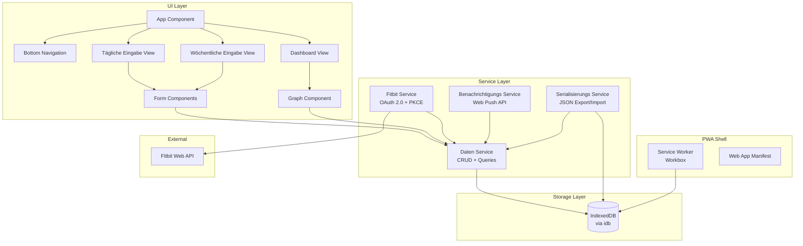
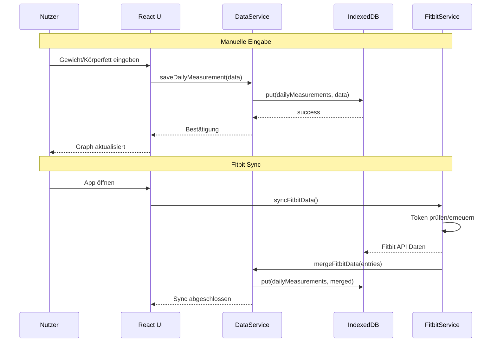

# Design-Dokument: Fitness Tracker PWA

## Übersicht

Die Fitness Tracker PWA ist eine minimalistische React-Webanwendung zur Erfassung und Visualisierung von Körpermessdaten. Die App wird als Progressive Web App auf dem iPhone installierbar sein und nutzt das DB UX Design System für ein konsistentes, adaptives UI.

Die Kernarchitektur basiert auf drei Säulen:
1. **Client-only Architektur** — Alle Daten werden lokal in IndexedDB gespeichert, kein Backend erforderlich
2. **Fitbit API Integration** — OAuth 2.0 mit PKCE für automatischen Abruf von Waagen-Daten
3. **Trade-Republic-Stil Graphen** — Minimalistische Liniendiagramme mit Touch-Interaktion

### Technologie-Stack

| Komponente | Technologie | Begründung |
|---|---|---|
| Framework | React 18+ mit TypeScript | Komponentenbasiert, großes Ökosystem |
| Build | Vite | Schnelle Builds, PWA-Plugin verfügbar |
| PWA | vite-plugin-pwa (Workbox) | Service Worker Generation, Manifest |
| Routing | React Router v6 | Drei Ansichten, Bottom-Navigation |
| Charts | Lightweight Canvas/SVG (z.B. uPlot oder custom SVG) | Minimaler Bundle-Size, Touch-Support |
| Speicher | IndexedDB via idb (Wrapper) | Strukturierte Daten, Indizes, async API |
| Styling | DB UX Design System (foundation.css, foundation-size.css) | Vorgabe, adaptive Themes |
| Testing | Vitest + fast-check | Unit- und Property-Based Testing |

### Designentscheidungen

- **Kein Backend**: Alle Daten bleiben auf dem Gerät. Export/Import als JSON für Backup.
- **uPlot statt Chart.js/Recharts**: Deutlich kleiner (~35KB vs ~200KB+), performant auf Mobile, Canvas-basiert mit Touch-Support.
- **idb statt raw IndexedDB**: Typsichere Promise-basierte API, minimaler Overhead (~1KB).
- **Vite statt CRA**: Schnellere Builds, native ESM, einfache PWA-Integration.

## Architektur



### Datenfluss




## Komponenten und Schnittstellen

### UI-Komponenten

#### App (Root)
- Verwaltet React Router mit drei Routen: `/` (Dashboard), `/daily` (Tägliche Eingabe), `/weekly` (Wöchentliche Eingabe)
- Rendert `BottomNavigation` persistent
- Setzt DB Design System Attribute auf `<html>`: kein explizites `data-color` (neutral default), kein `data-material` (filled default)

#### BottomNavigation
- Drei Einträge: Dashboard (Graph-Icon), Täglich (Plus-Icon), Wöchentlich (Ruler-Icon)
- Verwendet `data-interactive` auf aktiven Elementen
- Fixiert am unteren Bildschirmrand via `position: fixed`

#### DashboardView
- Zeigt aktuellen Wert prominent (Gewicht als Default)
- Prozentuale Veränderung zum Startwert des Zeitraums
- `TimeRangeSelector`: Buttons für 1W, 1M, 3M, 6M, 1J, Max
- `GraphComponent` für den gewählten Messwert
- Tab-Leiste zum Wechsel zwischen Gewicht, Körperfett, und Körperumfängen

#### GraphComponent
```typescript
interface GraphComponentProps {
  data: DataPoint[];
  timeRange: TimeRange;
  onCrosshair?: (point: DataPoint | null) => void;
  trendDirection: 'lower-is-better' | 'higher-is-better';
}

interface DataPoint {
  date: string; // ISO 8601 date
  value: number;
}

type TimeRange = '1W' | '1M' | '3M' | '6M' | '1J' | 'Max';
```
- Canvas-basiertes Liniendiagramm (uPlot)
- Keine Gitterlinien, keine Achsenbeschriftungen
- Linie grün bei abwärts-Trend (Gewichtsverlust), rot bei aufwärts-Trend
- Touch-Crosshair: Zeigt Wert + Datum beim Wischen
- Fallback-Text bei < 2 Datenpunkten

#### DailyInputView
```typescript
interface DailyMeasurement {
  date: string; // ISO 8601 date (YYYY-MM-DD)
  weight?: number; // kg, eine Dezimalstelle, 30-300
  bodyFat?: number; // %, eine Dezimalstelle, 1-60
  source: 'manual' | 'fitbit';
}
```
- Datumsfeld (vorausgefüllt mit heute)
- Gewicht-Eingabe: `inputmode="decimal"`, Validierung 30-300 kg
- Körperfett-Eingabe: `inputmode="decimal"`, Validierung 1-60%
- Lädt existierende Werte für das gewählte Datum
- Speichern-Button mit `data-material="vibrant"` und `data-interactive`

#### WeeklyInputView
```typescript
interface WeeklyMeasurement {
  date: string; // ISO 8601 date (YYYY-MM-DD), immer der Montag der Woche
  chest?: number; // Brust, cm
  waist?: number; // Taille, cm
  hip?: number; // Hüfte, cm
  upperArmLeft?: number; // Oberarm links, cm
  upperArmRight?: number; // Oberarm rechts, cm
  thighLeft?: number; // Oberschenkel links, cm
  thighRight?: number; // Oberschenkel rechts, cm
}
```
- Alle Umfangswerte: `inputmode="decimal"`, Validierung 10-200 cm
- Lädt existierende Werte für die aktuelle Woche
- Gleiche Formular-Patterns wie DailyInputView

### Service-Schnittstellen

#### DataService
```typescript
interface DataService {
  // Tägliche Messungen
  saveDailyMeasurement(measurement: DailyMeasurement): Promise<void>;
  getDailyMeasurement(date: string): Promise<DailyMeasurement | undefined>;
  getDailyMeasurements(from: string, to: string): Promise<DailyMeasurement[]>;
  deleteDailyMeasurement(date: string): Promise<void>;

  // Wöchentliche Messungen
  saveWeeklyMeasurement(measurement: WeeklyMeasurement): Promise<void>;
  getWeeklyMeasurement(weekStart: string): Promise<WeeklyMeasurement | undefined>;
  getWeeklyMeasurements(from: string, to: string): Promise<WeeklyMeasurement[]>;
  deleteWeeklyMeasurement(weekStart: string): Promise<void>;

  // Alle Daten
  getAllData(): Promise<ExportData>;
  importData(data: ExportData): Promise<ImportResult>;
  clearAllData(): Promise<void>;
}
```

#### FitbitService
```typescript
interface FitbitService {
  // OAuth 2.0 mit PKCE
  initiateAuth(): Promise<void>; // Redirect zu Fitbit
  handleCallback(code: string, state: string): Promise<void>;
  isConnected(): boolean;
  disconnect(): Promise<void>;

  // Datensync
  syncData(): Promise<SyncResult>;
}

interface SyncResult {
  newEntries: number;
  updatedEntries: number;
  errors: string[];
}
```

#### NotificationService
```typescript
interface NotificationService {
  requestPermission(): Promise<NotificationPermission>;
  isEnabled(): boolean;
  scheduleDailyReminder(): void;
  scheduleWeeklyReminder(): void;
  cancelAll(): void;
}
```

#### SerializationService
```typescript
interface SerializationService {
  serialize(data: ExportData): string; // Pretty-printed JSON
  deserialize(json: string): ExportData; // Parst und validiert
  validate(data: unknown): data is ExportData; // Schema-Validierung
  exportToFile(data: ExportData): void; // Download als .json
  importFromFile(file: File): Promise<ExportData>; // Liest und validiert
}
```


## Datenmodelle

### IndexedDB Schema

Die App verwendet eine IndexedDB-Datenbank `fitness-tracker` mit zwei Object Stores:

```typescript
// Datenbank: "fitness-tracker", Version 1
interface FitnessTrackerDB extends DBSchema {
  dailyMeasurements: {
    key: string; // date (YYYY-MM-DD)
    value: DailyMeasurement;
    indexes: {
      'by-date': string;
    };
  };
  weeklyMeasurements: {
    key: string; // weekStart date (YYYY-MM-DD, immer Montag)
    value: WeeklyMeasurement;
    indexes: {
      'by-date': string;
    };
  };
}
```

### Kern-Datentypen

```typescript
interface DailyMeasurement {
  date: string;        // Primary Key, ISO 8601 (YYYY-MM-DD)
  weight?: number;     // kg, 30.0 - 300.0, eine Dezimalstelle
  bodyFat?: number;    // %, 1.0 - 60.0, eine Dezimalstelle
  source: 'manual' | 'fitbit';
  updatedAt: string;   // ISO 8601 Timestamp
}

interface WeeklyMeasurement {
  date: string;            // Primary Key, Montag der Woche (YYYY-MM-DD)
  chest?: number;          // cm, 10.0 - 200.0
  waist?: number;          // cm, 10.0 - 200.0
  hip?: number;            // cm, 10.0 - 200.0
  upperArmLeft?: number;   // cm, 10.0 - 200.0
  upperArmRight?: number;  // cm, 10.0 - 200.0
  thighLeft?: number;      // cm, 10.0 - 200.0
  thighRight?: number;     // cm, 10.0 - 200.0
  updatedAt: string;       // ISO 8601 Timestamp
}
```

### Export/Import Format

```typescript
interface ExportData {
  version: 1;
  exportedAt: string; // ISO 8601 Timestamp
  dailyMeasurements: DailyMeasurement[];
  weeklyMeasurements: WeeklyMeasurement[];
}
```

### Validierungsregeln

| Feld | Typ | Min | Max | Dezimalstellen |
|---|---|---|---|---|
| weight | number | 30.0 | 300.0 | 1 |
| bodyFat | number | 1.0 | 60.0 | 1 |
| chest, waist, hip | number | 10.0 | 200.0 | 1 |
| upperArmLeft/Right | number | 10.0 | 200.0 | 1 |
| thighLeft/Right | number | 10.0 | 200.0 | 1 |

### Fitbit OAuth Token Storage

```typescript
interface FitbitTokens {
  accessToken: string;
  refreshToken: string;
  expiresAt: number; // Unix timestamp in ms
  userId: string;
}
```

Tokens werden in einem separaten IndexedDB Store `fitbitAuth` gespeichert (nicht im Export enthalten).

### Zeitraum-Berechnung

```typescript
function getDateRange(range: TimeRange): { from: string; to: string } {
  const to = new Date(); // heute
  const from = new Date();
  switch (range) {
    case '1W': from.setDate(from.getDate() - 7); break;
    case '1M': from.setMonth(from.getMonth() - 1); break;
    case '3M': from.setMonth(from.getMonth() - 3); break;
    case '6M': from.setMonth(from.getMonth() - 6); break;
    case '1J': from.setFullYear(from.getFullYear() - 1); break;
    case 'Max': from.setFullYear(2000); break;
  }
  return { from: formatDate(from), to: formatDate(to) };
}
```


## Korrektheitseigenschaften

*Eine Korrektheitseigenschaft ist ein Merkmal oder Verhalten, das für alle gültigen Ausführungen eines Systems gelten sollte — im Wesentlichen eine formale Aussage darüber, was das System tun soll. Eigenschaften bilden die Brücke zwischen menschenlesbaren Spezifikationen und maschinell verifizierbaren Korrektheitsgarantien.*

### Property 1: Messwert-Validierung

*Für jeden* numerischen Wert und jedes Messfeld mit definiertem Wertebereich (Gewicht: 30-300, Körperfett: 1-60, Umfänge: 10-200) soll die Validierungsfunktion den Wert genau dann akzeptieren, wenn er innerhalb des definierten Bereichs liegt.

**Validates: Requirements 3.4, 3.5, 4.4**

### Property 2: Messdaten-Speicherung Round-Trip

*Für jede* gültige Messung (DailyMeasurement oder WeeklyMeasurement), wenn sie über den DataService gespeichert wird, soll das anschließende Abrufen über den gleichen Schlüssel (Datum) ein äquivalentes Objekt zurückliefern.

**Validates: Requirements 3.3, 3.6, 4.3, 4.5**

### Property 3: Zeitraum-Abfrage Korrektheit

*Für jede* Menge von Messungen und jeden Datumsbereich (from, to) soll die Abfrage `getMeasurements(from, to)` genau diejenigen Messungen zurückliefern, deren Datum innerhalb des Bereichs [from, to] liegt, und keine anderen.

**Validates: Requirements 7.2**

### Property 4: Export-Import Round-Trip

*Für jedes* gültige ExportData-Objekt soll gelten: `serialize(getAllData(importData(deserialize(serialize(data)))))` ist identisch mit `serialize(data)`. Das heißt, Export → Import → Export produziert ein identisches JSON-Ergebnis.

**Validates: Requirements 7.6**

### Property 5: Serialisierung Round-Trip

*Für jedes* gültige ExportData-Objekt soll gelten: `deserialize(serialize(data))` produziert ein äquivalentes Objekt zu `data`. Parsen und Formatieren sind zueinander invers.

**Validates: Requirements 9.5**

### Property 6: Serialisierung erzeugt gültiges JSON

*Für jedes* gültige ExportData-Objekt soll die `serialize`-Funktion einen String produzieren, der gültiges JSON ist und dem definierten ExportData-Schema entspricht (enthält `version`, `exportedAt`, `dailyMeasurements`, `weeklyMeasurements`).

**Validates: Requirements 9.1, 9.4**

### Property 7: Deserialisierung und Validierung

*Für jeden* beliebigen String soll die `deserialize`-Funktion genau dann erfolgreich ein ExportData-Objekt zurückliefern, wenn der String gültiges JSON ist und dem ExportData-Schema entspricht. Für alle anderen Eingaben soll ein beschreibender Fehler geworfen werden.

**Validates: Requirements 9.2, 9.3**

### Property 8: PKCE Code Challenge Generierung

*Für jeden* zufällig generierten Code Verifier soll der zugehörige Code Challenge dem Base64url-kodierten SHA-256-Hash des Verifiers entsprechen, und die generierte Authorization-URL soll die Parameter `code_challenge`, `code_challenge_method=S256`, `response_type=code` und `client_id` enthalten.

**Validates: Requirements 2.1**

### Property 9: Fitbit-Daten Transformation

*Für jeden* gültigen Fitbit Weight Log Eintrag (mit Datum, Gewicht und optional Körperfett) soll die Transformation eine gültige DailyMeasurement mit `source: 'fitbit'` produzieren, wobei das Datum korrekt übernommen und die Werte korrekt konvertiert werden.

**Validates: Requirements 2.4**

### Property 10: Token-Speicherung Round-Trip

*Für jedes* gültige FitbitTokens-Objekt soll gelten: Speichern und anschließendes Abrufen liefert ein äquivalentes Objekt zurück. Nach `disconnect()` soll `isConnected()` false zurückgeben.

**Validates: Requirements 2.2, 2.7**

### Property 11: Prozentuale Veränderung Berechnung

*Für jeden* Startwert (> 0) und jeden aktuellen Wert soll die berechnete prozentuale Veränderung gleich `((aktuell - start) / start) * 100` sein, gerundet auf eine Dezimalstelle.

**Validates: Requirements 5.3**

### Property 12: Zeitraum-Filter Berechnung

*Für jeden* TimeRange-Wert (1W, 1M, 3M, 6M, 1J, Max) und jedes Referenzdatum soll die `getDateRange`-Funktion einen Bereich zurückliefern, dessen Differenz dem erwarteten Zeitraum entspricht (7 Tage, 1 Monat, 3 Monate, 6 Monate, 1 Jahr, bzw. ab 2000).

**Validates: Requirements 5.4**

### Property 13: Trend-Richtung Bestimmung

*Für jede* Datenreihe mit mindestens zwei Punkten soll die Trend-Richtung korrekt bestimmt werden: Wenn der letzte Wert kleiner als der erste ist, ist der Trend abwärts (grün/positiv für Gewicht). Wenn der letzte Wert größer als der erste ist, ist der Trend aufwärts (rot/negativ für Gewicht).

**Validates: Requirements 5.8**

### Property 14: Benachrichtigungs-Logik

*Für jedes* Datum und jeden Messungstyp (täglich/wöchentlich) soll die Funktion `shouldNotify` genau dann `true` zurückgeben, wenn keine Messung für den entsprechenden Zeitraum (Tag bzw. Woche) existiert und Benachrichtigungen aktiviert sind.

**Validates: Requirements 6.2, 6.3, 6.5**


## Fehlerbehandlung

### Kategorien

| Kategorie | Beispiel | Behandlung |
|---|---|---|
| Validierungsfehler | Gewicht < 30 oder > 300 | Inline-Fehlermeldung am Eingabefeld, Speichern blockiert |
| Fitbit API Fehler | 401, 429, 500 | Toast-Benachrichtigung mit Fehlerbeschreibung, manueller Modus bleibt verfügbar |
| Token-Ablauf | Access Token expired | Automatischer Refresh via Refresh Token, bei Fehlschlag: erneute Authentifizierung anfordern |
| Import-Fehler | Ungültiges JSON, falsches Schema | Fehlermeldung mit Beschreibung des Problems (z.B. "Feld 'version' fehlt") |
| IndexedDB Fehler | QuotaExceededError | Hinweis an Nutzer, Daten zu exportieren und Browser-Speicher freizugeben |
| Netzwerkfehler | Offline bei Fitbit-Sync | Stille Behandlung, Sync beim nächsten Online-Zustand wiederholen |

### Fehlerbehandlungs-Strategie

1. **Validierungsfehler** werden synchron am Formular angezeigt, bevor Daten gespeichert werden
2. **API-Fehler** werden über einen zentralen Error-Handler verarbeitet, der eine benutzerfreundliche Meldung generiert
3. **Speicherfehler** werden geloggt und dem Nutzer als Toast angezeigt
4. **Import-Fehler** geben detaillierte Informationen über die Ursache (welches Feld, welcher Wert)
5. **Alle Fehler** werden in der Konsole geloggt für Debugging-Zwecke

### Fitbit-spezifische Fehlerbehandlung

```typescript
// HTTP Status → Benutzeraktion
// 401 Unauthorized → Token refresh, bei Fehlschlag: erneut verbinden
// 429 Too Many Requests → Retry nach Retry-After Header
// 500+ Server Error → "Fitbit-Server nicht erreichbar, bitte später versuchen"
```

## Teststrategie

### Dualer Testansatz

Die App verwendet sowohl Unit-Tests als auch Property-Based Tests für umfassende Abdeckung:

- **Unit-Tests (Vitest)**: Spezifische Beispiele, Edge Cases, Integrationspunkte
- **Property-Based Tests (Vitest + fast-check)**: Universelle Eigenschaften über alle gültigen Eingaben

### Property-Based Testing Konfiguration

- **Bibliothek**: `fast-check` (für TypeScript/JavaScript)
- **Minimum Iterationen**: 100 pro Property-Test
- **Tagging-Format**: `Feature: fitness-tracker-pwa, Property {nummer}: {beschreibung}`
- **Jede Korrektheitseigenschaft wird durch genau EINEN Property-Based Test implementiert**

### Testplan

#### Property-Based Tests (fast-check)

| Property | Test-Beschreibung | Generatoren |
|---|---|---|
| P1: Messwert-Validierung | Zufällige Zahlen gegen Validierungsfunktion | `fc.float()` für Werte innerhalb/außerhalb der Bereiche |
| P2: Messdaten-Speicherung | Save/Retrieve Round-Trip | `fc.record()` für DailyMeasurement/WeeklyMeasurement |
| P3: Zeitraum-Abfrage | Abfrage mit zufälligen Datumsbereichen | `fc.date()` für Bereiche, `fc.array()` für Messungen |
| P4: Export-Import Round-Trip | Export → Import → Export Identität | `fc.record()` für ExportData |
| P5: Serialisierung Round-Trip | serialize → deserialize Identität | `fc.record()` für ExportData |
| P6: Gültiges JSON | serialize produziert valides JSON | `fc.record()` für ExportData |
| P7: Deserialisierung | Gültige/ungültige Strings | `fc.string()`, `fc.json()`, `fc.record()` |
| P8: PKCE Challenge | Verifier → Challenge Korrektheit | `fc.string()` für Code Verifier |
| P9: Fitbit Transformation | API-Response → DailyMeasurement | `fc.record()` für Fitbit Weight Log |
| P10: Token-Speicherung | Save/Retrieve/Disconnect | `fc.record()` für FitbitTokens |
| P11: Prozentuale Veränderung | Berechnung für beliebige Wertpaare | `fc.float({min: 0.1})` für Start/Aktuell |
| P12: Zeitraum-Filter | getDateRange für alle TimeRange-Werte | `fc.constantFrom('1W','1M','3M','6M','1J','Max')` |
| P13: Trend-Richtung | Trend für beliebige Datenreihen | `fc.array(fc.record())` für DataPoint[] |
| P14: Benachrichtigungs-Logik | shouldNotify für beliebige Zustände | `fc.date()`, `fc.boolean()` für Messungs-Existenz |

#### Unit-Tests (Vitest)

| Bereich | Tests |
|---|---|
| Formular-Validierung | Grenzwerte (30.0, 300.0, 1.0, 60.0, 10.0, 200.0), leere Eingaben |
| Datums-Hilfsfunktionen | Wochenstart-Berechnung (Montag), ISO-Formatierung |
| Graph-Rendering | Fallback bei < 2 Datenpunkten, Farbauswahl nach Trend |
| Fitbit OAuth | Authorization-URL Aufbau, Token-Refresh Logik |
| Import Edge Cases | Leere Datei, fehlende Felder, doppelte Datumseinträge |
| Benachrichtigungen | Deaktivierte Benachrichtigungen, Sonntags-Logik |

### Testausführung

```bash
# Alle Tests einmalig ausführen
npx vitest --run

# Nur Property-Tests
npx vitest --run --grep "Property"

# Nur Unit-Tests
npx vitest --run --grep -v "Property"
```
