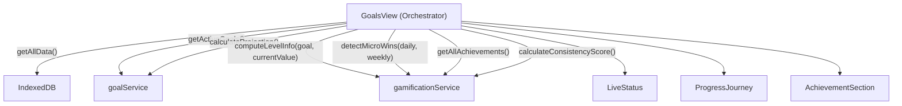
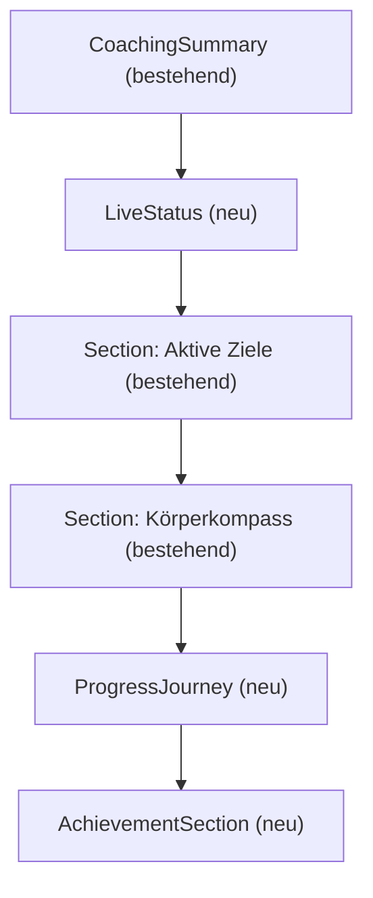

# Design: Gamification-Restrukturierung

## Übersicht

Die GoalsView wird von einer flachen "kognitiven Suppe" (Konsistenz-Notification, NSV-Karten, Milestone-Karten, Streak-Karten gemischt) in ein klares 3-Schichten-Modell umgebaut:

1. **Live-Status** — tägliches Echtzeit-Feedback (Trend, Micro-Wins, Konsistenz)
2. **Progress/Journey** — Level-System mit Fortschrittsbalken pro Ziel
3. **Achievement-Section** — nur echte, verdiente Meilensteine (Progress + Streak)

Der `gamificationService.ts` wird um drei Kernfunktionen erweitert: `computeLevelInfo`, `detectMicroWins`, `getAllAchievements`. Die bestehenden Funktionen (`evaluateMilestones`, `calculateConsistencyScore`, `getStreaks`) bleiben erhalten. Neue Typen werden in `src/types/index.ts` ergänzt.

## Architektur

### Datenfluss



### GoalsView Layout-Reihenfolge



Alle drei neuen Bereiche werden nur gerendert, wenn `activeGoals.length > 0`.

### Entscheidungen

- **Kein neuer IndexedDB-Store**: Achievements werden weiterhin im bestehenden `milestones`-Store gespeichert. Die `ACHIEVEMENT_DEFINITIONS`-Registry ist eine statische Konstante im Service, die zur Laufzeit mit dem earned-Status aus IndexedDB gemerged wird.
- **Reine Funktionen bevorzugt**: `computeLevelInfo` und `detectMicroWins` sind pure Functions ohne DB-Zugriff. Nur `getAllAchievements` liest aus IndexedDB.
- **Bestehende AchievementCard wird angepasst**, nicht ersetzt. Sie bekommt einen `locked`-Zustand mit Schloss-Icon.

## Komponenten und Schnittstellen

### Neue Komponenten

#### `LiveStatus` (`src/components/LiveStatus.tsx`)

```tsx
interface LiveStatusProps {
  projection: GoalProjection | null
  consistencyScore: ConsistencyScore | null
  microWins: MicroWin[]
}
```

Zeigt:
- Trend-Feedback als prominenten Text ("auf Kurs", "leicht voraus", "hinter Plan", "Noch nicht genug Daten")
- Konsistenz-Score als `Notification`-Komponente mit farbigem `data-color` basierend auf Score-Level
- Micro-Wins als einzeilige Texte

Verwendet: `Notification` (core), `.adaptive`, `data-color`, `data-material`

#### `ProgressJourney` (`src/components/ProgressJourney.tsx`)

```tsx
interface ProgressJourneyProps {
  goals: Goal[]
  projections: Map<string, GoalProjection>
  dailyMeasurements: DailyMeasurement[]
  weeklyMeasurements: WeeklyMeasurement[]
}
```

Zeigt pro aktivem Ziel:
- Level-Anzeige ("Level 2 / 4")
- Fortschrittsbalken (CSS `var(--size-*)` Tokens)
- Absoluter Fortschritt ("8 / 15 kg erreicht")
- `data-color` basierend auf Trend-Feedback der Projection

Verwendet: `computeLevelInfo()` aus gamificationService, `.adaptive`, `data-color`

#### `AchievementSection` (`src/components/AchievementSection.tsx`)

```tsx
interface AchievementSectionProps {
  achievements: Achievement[]
}
```

Zeigt:
- Verdiente Achievements zuerst (Häkchen-Symbol), gesperrte danach (Schloss-Symbol)
- Kompakte Karten ohne Fließtext
- Nur Progress- und Streak-Achievements

Verwendet: angepasste `AchievementCard`, `Section` (core)

### Angepasste Komponenten

#### `AchievementCard` — Erweiterung

Die bestehende `AchievementCard` wird erweitert, um sowohl `Milestone` (earned) als auch `Achievement` (earned/locked) zu unterstützen:

```tsx
interface AchievementCardProps {
  achievement: Achievement  // neuer Typ statt Milestone | StreakAchievement
  onClick?: () => void
}
```

- Earned: Häkchen-Icon, `data-color="violet"`, Datum anzeigen
- Locked: Schloss-Icon, `data-color` neutral (kein Farbattribut), Label ausgegraut

### Entfernte Elemente aus GoalsView

- `Section "Fortschritt & Erfolge"` komplett entfernt
- Konsistenz-Notification (wandert in LiveStatus)
- NSV-Karten (ersetzt durch Micro-Wins in LiveStatus)
- Milestone-Karten (wandern in AchievementSection)
- Streak-Karten (wandern in AchievementSection als Streak-Achievements)
- Imports: `Sparkles`, `StreakAchievement`, `NonScaleVictory` werden nicht mehr in GoalsView benötigt


## Datenmodelle

### Neue Typen in `src/types/index.ts`

```typescript
/** Kategorie eines Achievements */
export type AchievementCategory = 'progress' | 'streak'

/** Status eines Achievements */
export type AchievementStatus = 'locked' | 'earned'

/** Statische Definition eines Achievements (Registry-Eintrag) */
export interface AchievementDefinition {
  /** Eindeutige ID, entspricht MilestoneType */
  id: MilestoneType
  /** Deutsches Label für die Anzeige */
  label: string
  /** Kategorie: progress oder streak */
  category: AchievementCategory
  /** Emoji oder Icon-Bezeichner */
  icon: string
}

/** Laufzeit-Achievement mit Status (merged aus Definition + IndexedDB) */
export interface Achievement {
  /** Statische Definition */
  definition: AchievementDefinition
  /** Aktueller Status */
  status: AchievementStatus
  /** Datum der Erreichung (nur bei earned) */
  earnedAt?: string
}

/** Level-Information für ein Ziel */
export interface LevelInfo {
  /** Aktuelles Level (1-basiert) */
  level: number
  /** Gesamtanzahl der Levels */
  totalLevels: number
  /** Fortschritt innerhalb des aktuellen Levels (0-100) */
  levelProgress: number
  /** Gesamtfortschritt über alle Levels (0-100) */
  overallProgress: number
  /** Absoluter Fortschrittstext, z.B. "8 / 15 kg erreicht" */
  absoluteText: string
}

/** Ein erkannter Micro-Win für den Live-Status */
export interface MicroWin {
  /** Kurzer einzeiliger Text, z.B. "−0.6% Körperfett" */
  text: string
  /** Welche Metrik betroffen ist */
  metric: 'bodyFat' | CircumferenceZone
}
```

### Erweiterung von `MilestoneType`

```typescript
export type MilestoneType =
  | 'first-goal-reached'
  | 'weight-loss-2kg'    // NEU
  | 'weight-loss-5kg'
  | 'weight-loss-10kg'   // NEU
  | 'daily-streak-7'     // NEU (ersetzt daily-streak-10)
  | 'daily-streak-10'
  | 'daily-streak-30'
  | 'weekly-streak-3'    // NEU (ersetzt weekly-streak-4)
  | 'weekly-streak-4'
  | 'weekly-streak-10'   // NEU (ersetzt weekly-streak-12)
  | 'weekly-streak-12'
```

Die alten Typen (`daily-streak-10`, `weekly-streak-4`, `weekly-streak-12`) bleiben für Rückwärtskompatibilität erhalten, damit bereits verdiente Milestones weiterhin korrekt angezeigt werden.

## Level-System-Algorithmus

### `computeLevelInfo(goal: Goal, currentValue: number): LevelInfo`

Pure Function — kein DB-Zugriff.

**Stufenanzahl-Berechnung:**
```
totalDistance = |startValue - targetValue|
if totalDistance < 6  → totalLevels = 3
else if totalDistance < 12 → totalLevels = 4
else → totalLevels = 5
```

**Stufengrenzen:**
```
stepSize = totalDistance / totalLevels
boundaries = [startValue, startValue ± 1*stepSize, ..., targetValue]
```

Die Richtung (abnehmend vs. zunehmend) wird durch `direction = targetValue < startValue ? -1 : 1` bestimmt.

**Aktuelles Level:**
```
progress = |currentValue - startValue| (in Richtung Ziel)
level = floor(progress / stepSize) + 1, clamped to [1, totalLevels]
```

Wenn `currentValue` das Ziel erreicht oder überschreitet → `level = totalLevels`.

**Level-Fortschritt:**
```
progressInLevel = progress - (level - 1) * stepSize
levelProgress = (progressInLevel / stepSize) * 100, clamped to [0, 100]
```

**Absoluter Text:**
```
Einheit = "kg" | "%" | "cm" (basierend auf metricType)
"X / Y {Einheit} erreicht"
```

Wobei X = bisheriger Fortschritt (gerundet auf 1 Dezimalstelle), Y = totalDistance.

**Determinismus:** Identische Eingaben (startValue, targetValue, currentValue, metricType) → identische Ausgabe. Kein Zufall, kein Datum, kein State.

## Achievement-Registry

### Statische Definitionen

```typescript
const ACHIEVEMENT_DEFINITIONS: AchievementDefinition[] = [
  // Progress-Achievements
  { id: 'weight-loss-2kg',    label: '2 kg verloren',           category: 'progress', icon: '🏋️' },
  { id: 'weight-loss-5kg',    label: '5 kg verloren',           category: 'progress', icon: '💪' },
  { id: 'weight-loss-10kg',   label: '10 kg verloren',          category: 'progress', icon: '🏆' },
  { id: 'first-goal-reached', label: 'Erstes Ziel erreicht',    category: 'progress', icon: '🎯' },
  // Streak-Achievements
  { id: 'daily-streak-7',     label: '7 Tage eingetragen',      category: 'streak',   icon: '🔥' },
  { id: 'daily-streak-30',    label: '30 Tage eingetragen',     category: 'streak',   icon: '🔥' },
  { id: 'weekly-streak-3',    label: '3 Wochen am Stück',       category: 'streak',   icon: '📏' },
  { id: 'weekly-streak-10',   label: '10 Wochen getrackt',      category: 'streak',   icon: '📏' },
]
```

### `getAllAchievements(): Promise<Achievement[]>`

1. Lade alle `Milestone`-Einträge aus IndexedDB (`getEarnedMilestones()`)
2. Für jede `AchievementDefinition`:
   - Suche passenden Milestone mit `milestone.type === definition.id`
   - Wenn gefunden: `{ definition, status: 'earned', earnedAt: milestone.earnedAt }`
   - Wenn nicht: `{ definition, status: 'locked' }`
3. Rückgabe: vollständige Liste aller Achievements

### Erweiterte `evaluateMilestones`

Neue Checks hinzufügen (zusätzlich zu bestehenden):

| Typ | Bedingung |
|-----|-----------|
| `weight-loss-2kg` | `calculateWeightLoss(daily) >= 2.0` |
| `weight-loss-10kg` | `calculateWeightLoss(daily) >= 10.0` |
| `daily-streak-7` | `streaks.dailyStreak >= 7` |
| `weekly-streak-3` | `streaks.weeklyStreak >= 3` |
| `weekly-streak-10` | `streaks.weeklyStreak >= 10` |

Bestehende Checks (`weight-loss-5kg`, `daily-streak-10`, `daily-streak-30`, `weekly-streak-4`, `weekly-streak-12`) bleiben erhalten.


## Micro-Win-Erkennung

### `detectMicroWins(dailyMeasurements, weeklyMeasurements): MicroWin[]`

Pure Function — refactored aus `detectNonScaleVictories`, aber mit vereinfachter Ausgabe.

**Unterschied zu `detectNonScaleVictories`:**
- Kein "stabile Waage"-Voraussetzung für Umfangs-Micro-Wins (jede Reduktion >0.5cm zählt)
- Rückgabe als `MicroWin[]` statt `NonScaleVictory[]` (kurze Texte, kein Fließtext)
- Gleicher 14-Tage-Zeitraum

**Algorithmus:**

1. **Körperfett-Check:**
   - Filtere `dailyMeasurements` auf letzte 14 Tage mit `bodyFat != null`
   - Wenn ≥2 Einträge: `drop = earliest.bodyFat - latest.bodyFat`
   - Wenn `drop > 0.5`: → `MicroWin { text: "−{drop}% Körperfett", metric: "bodyFat" }`

2. **Umfang-Check (pro Zone):**
   - Filtere `weeklyMeasurements` auf letzte 14 Tage
   - Wenn ≥2 Einträge: Für jede Zone mit Werten: `drop = earliest[zone] - latest[zone]`
   - Wenn `drop > 0.5`: → `MicroWin { text: "−{drop} cm {ZoneLabel}", metric: zone }`

Die bestehende `detectNonScaleVictories` bleibt erhalten (Rückwärtskompatibilität), wird aber nicht mehr in GoalsView verwendet.

## GoalsView-Umbau

### Vorher (aktuell)

```
CoachingSummary
Section "Aktive Ziele" (GoalCards + Button)
Section "Körperkompass" (BodyCompass)
Section "Fortschritt & Erfolge"
  ├── Konsistenz-Notification
  ├── NSV-Karten
  ├── Milestone-AchievementCards
  └── Streak-AchievementCards
```

### Nachher

```
CoachingSummary
LiveStatus (Trend + Konsistenz + Micro-Wins)
Section "Aktive Ziele" (GoalCards + Button)
Section "Körperkompass" (BodyCompass)
ProgressJourney (Level-System pro Ziel)
AchievementSection (earned + locked Achievements)
```

### Änderungen in GoalsView

1. **Entfernen:** Gesamter `Section "Fortschritt & Erfolge"` Block inkl. Konsistenz-Notification, NSV-Karten, Milestone-Karten, Streak-Karten
2. **Neue State-Variablen:** `microWins: MicroWin[]`, `achievements: Achievement[]`
3. **Entfernte State-Variablen:** `nonScaleVictories`, `streaks` (werden nicht mehr direkt in GoalsView benötigt)
4. **Neue Imports:** `LiveStatus`, `ProgressJourney`, `AchievementSection`, `detectMicroWins`, `getAllAchievements`
5. **Entfernte Imports:** `Sparkles`, `StreakAchievement`, `NonScaleVictory`, `Streaks`
6. **loadData-Anpassung:** `detectMicroWins()` statt `detectNonScaleVictories()`, `getAllAchievements()` aufrufen

### Bedingte Anzeige

Alle drei neuen Bereiche (LiveStatus, ProgressJourney, AchievementSection) werden nur gerendert wenn `activeGoals.length > 0`. Dies entspricht Requirement 1.3.


## Correctness Properties

*Eine Property ist eine Eigenschaft oder ein Verhalten, das über alle gültigen Ausführungen eines Systems hinweg gelten sollte — im Wesentlichen eine formale Aussage darüber, was das System tun soll. Properties bilden die Brücke zwischen menschenlesbaren Spezifikationen und maschinenverifizierbaren Korrektheitsgarantien.*

### Property 1: Level-Determinismus

*Für alle* gültigen Ziele (Goal) und beliebige aktuelle Messwerte (currentValue), soll `computeLevelInfo(goal, v)` bei zweimaligem Aufruf mit identischen Eingaben ein identisches `LevelInfo`-Objekt liefern.

**Validates: Requirements 10.5**

### Property 2: Level-Anzahl im Bereich [3, 5]

*Für alle* gültigen Ziele mit `startValue ≠ targetValue`, soll `computeLevelInfo` ein `totalLevels` im Bereich [3, 5] zurückgeben.

**Validates: Requirements 10.2, 3.1**

### Property 3: Gleichmäßige Stufengrößen

*Für alle* gültigen Ziele, soll die Gesamtdistanz (`|startValue - targetValue|`) gleichmäßig auf `totalLevels` Stufen aufgeteilt werden, sodass jede Stufe die gleiche Größe `totalDistance / totalLevels` hat.

**Validates: Requirements 3.5, 10.1**

### Property 4: Korrekte Einheit im Fortschrittstext

*Für alle* gültigen Ziele und beliebige aktuelle Messwerte, soll `computeLevelInfo.absoluteText` die korrekte Einheit enthalten: "kg" für `metricType === 'weight'`, "%" für `bodyFat`, "cm" für `circumference`.

**Validates: Requirements 3.4, 3.6, 3.7, 3.8**

### Property 5: Gewichtsverlust-Achievements bei Schwellenwert

*Für alle* Sätze von DailyMeasurements mit kumulativem Gewichtsverlust ≥ T (wobei T ∈ {2, 5, 10} kg), soll `evaluateMilestones` den entsprechenden Milestone (`weight-loss-2kg`, `weight-loss-5kg`, `weight-loss-10kg`) als neu verdient zurückgeben, sofern er nicht bereits verdient wurde.

**Validates: Requirements 5.1, 5.2, 5.3**

### Property 6: Erstes-Ziel-erreicht-Achievement

*Für alle* Sätze von Goals, in denen mindestens ein Goal den Status `'reached'` hat, soll `evaluateMilestones` den Milestone `first-goal-reached` als verdient zurückgeben, sofern er nicht bereits verdient wurde.

**Validates: Requirements 5.4**

### Property 7: Streak-Achievements bei Schwellenwert

*Für alle* Streak-Zustände mit `dailyStreak ≥ D` (D ∈ {7, 30}) oder `weeklyStreak ≥ W` (W ∈ {3, 10}), soll `evaluateMilestones` den entsprechenden Streak-Milestone als verdient zurückgeben, sofern er nicht bereits verdient wurde.

**Validates: Requirements 6.1, 6.2, 6.3, 6.4**

### Property 8: Achievement-Deduplizierung (Idempotenz)

*Für alle* MilestoneContexte, in denen ein bestimmter Milestone bereits in `earnedMilestones` enthalten ist, soll `evaluateMilestones` diesen Milestone nicht erneut in der Rückgabeliste enthalten.

**Validates: Requirements 5.5, 6.6**

### Property 9: Streak-Unterbrechung bewahrt verdiente Achievements

*Für alle* bereits verdienten Streak-Achievements, soll eine Unterbrechung des Streaks (Streak-Zähler auf 0) den earned-Status des Achievements nicht verändern. `getAllAchievements` soll das Achievement weiterhin als `'earned'` zurückgeben.

**Validates: Requirements 6.5**

### Property 10: Micro-Win-Erkennung bei Schwellenwertüberschreitung

*Für alle* Sätze von Messdaten, in denen innerhalb der letzten 14 Tage der Körperfettanteil um >0.5% gesunken ist oder ein Umfangswert um >0.5 cm gesunken ist, soll `detectMicroWins` mindestens einen entsprechenden `MicroWin` zurückgeben.

**Validates: Requirements 7.1, 7.2, 2.2**

### Property 11: Achievement-Datenmodell-Vollständigkeit

*Für alle* Achievements, die von `getAllAchievements` zurückgegeben werden: (a) jedes Achievement hat eine eindeutige `definition.id`, ein deutsches `definition.label`, ein `definition.category` ∈ {'progress', 'streak'} und einen `status` ∈ {'locked', 'earned'}; (b) jedes Achievement mit `status === 'earned'` hat ein definiertes `earnedAt`; (c) die Gesamtanzahl entspricht der Anzahl der `ACHIEVEMENT_DEFINITIONS`.

**Validates: Requirements 9.1, 9.2, 9.3, 9.4**

### Property 12: Achievement-Sortierung

*Für alle* Listen von Achievements, soll die AchievementSection die Achievements so sortieren, dass alle Achievements mit `status === 'earned'` vor allen Achievements mit `status === 'locked'` erscheinen.

**Validates: Requirements 4.6**

### Property 13: Achievement-Icon entspricht Status

*Für alle* Achievements in der AchievementSection, soll ein Achievement mit `status === 'earned'` ein Häkchen-Symbol und ein Achievement mit `status === 'locked'` ein Schloss-Symbol anzeigen.

**Validates: Requirements 4.4**

### Property 14: Trend-Feedback-Text-Zuordnung

*Für alle* GoalProjection-Objekte mit einem `trendFeedback`-Wert, soll der LiveStatus den korrekten deutschen Text anzeigen: 'ahead' → "leicht voraus", 'on-track' → "auf Kurs", 'behind' → "hinter Plan", 'insufficient-data' → "Noch nicht genug Daten".

**Validates: Requirements 2.1, 2.5**


## Fehlerbehandlung

### `computeLevelInfo`
- **startValue === targetValue**: Rückgabe `{ level: 1, totalLevels: 1, levelProgress: 100, overallProgress: 100, absoluteText: "0 / 0 {unit} erreicht" }` — degenerierter Fall, kein Crash
- **currentValue außerhalb des Bereichs**: Clamping auf [0, totalLevels] für Level, [0, 100] für Progress-Werte
- **Negative Distanz**: `Math.abs()` wird verwendet, Richtung wird separat bestimmt

### `detectMicroWins`
- **Leere Messdaten**: Rückgabe `[]` — keine Micro-Wins
- **Weniger als 2 Einträge im 14-Tage-Fenster**: Kein Vergleich möglich, Rückgabe `[]`
- **Fehlende Felder** (`bodyFat === undefined`, `zone === undefined`): Werden übersprungen, kein Fehler

### `getAllAchievements`
- **IndexedDB-Fehler**: Fallback auf alle Achievements als `'locked'` — die App zeigt trotzdem die Registry an
- **Unbekannte MilestoneTypes in DB**: Werden ignoriert (nur bekannte `ACHIEVEMENT_DEFINITIONS` werden gemerged)

### `evaluateMilestones`
- **Bestehende Fehlerbehandlung bleibt**: Neue Milestone-Typen folgen dem gleichen Pattern wie bestehende

### UI-Komponenten
- **Null/undefined Props**: Alle drei neuen Komponenten rendern graceful bei fehlenden Daten (leere Listen, null-Projections)
- **Keine aktiven Ziele**: Alle drei Bereiche werden nicht gerendert (Guard in GoalsView)

## Teststrategie

### Property-Based Testing

**Library:** [fast-check](https://github.com/dubzzz/fast-check) (bereits im Projekt oder als devDependency hinzuzufügen)

**Konfiguration:** Minimum 100 Iterationen pro Property-Test.

Jeder Property-Test wird mit einem Kommentar getaggt:
```
// Feature: gamification-restructure, Property {N}: {Titel}
```

**Property-Tests (1 Test pro Property):**

| Property | Testdatei | Generator |
|----------|-----------|-----------|
| P1: Level-Determinismus | `gamificationService.test.ts` | `fc.record({ startValue: fc.float(), targetValue: fc.float(), currentValue: fc.float() })` |
| P2: Level-Anzahl [3,5] | `gamificationService.test.ts` | Gültige Goals mit `startValue ≠ targetValue` |
| P3: Gleichmäßige Stufen | `gamificationService.test.ts` | Gültige Goals |
| P4: Korrekte Einheit | `gamificationService.test.ts` | Goals mit zufälligem `metricType` |
| P5: Gewichtsverlust-Achievements | `gamificationService.test.ts` | DailyMeasurements mit variablem Gewichtsverlust |
| P6: Erstes-Ziel-erreicht | `gamificationService.test.ts` | Goals mit zufälligem Status |
| P7: Streak-Achievements | `gamificationService.test.ts` | Streaks mit zufälligen Zählern |
| P8: Deduplizierung | `gamificationService.test.ts` | MilestoneContexte mit bereits verdienten Milestones |
| P9: Streak-Bruch bewahrt | `gamificationService.test.ts` | Earned Milestones + Streak-Reset |
| P10: Micro-Win-Erkennung | `gamificationService.test.ts` | Messdaten mit variablen Drops |
| P11: Datenmodell-Vollständigkeit | `gamificationService.test.ts` | Zufällige earned-Milestone-Sets |
| P12: Achievement-Sortierung | `AchievementSection.test.tsx` | Zufällige Achievement-Listen |
| P13: Icon-Status-Zuordnung | `AchievementSection.test.tsx` | Zufällige Achievements |
| P14: Trend-Text-Zuordnung | `LiveStatus.test.tsx` | Zufällige trendFeedback-Werte |

### Unit-Tests (Beispiele und Edge-Cases)

| Test | Beschreibung |
|------|-------------|
| GoalsView: 3-Schichten-Reihenfolge | Render mit aktiven Zielen, prüfe DOM-Reihenfolge (Req 1.1) |
| GoalsView: Kein "Fortschritt & Erfolge" | Prüfe Abwesenheit der alten Section (Req 1.2, 8.1) |
| GoalsView: Keine Bereiche ohne Ziele | Render ohne Ziele, prüfe Abwesenheit aller drei Bereiche (Req 1.3) |
| LiveStatus: Konsistenz-Indikator | Render mit Score, prüfe Notification-Anzeige (Req 2.3) |
| LiveStatus: Keine Achievements | Prüfe Abwesenheit von Achievement-Karten (Req 2.4) |
| LiveStatus: Insufficient Data | Render mit null-Projection, prüfe "Noch nicht genug Daten" (Req 2.5) |
| ProgressJourney: Level-Anzeige | Render mit LevelInfo, prüfe Level/Progress/Text (Req 3.2) |
| computeLevelInfo: Ziel erreicht | currentValue === targetValue → höchstes Level (Req 10.4) |
| computeLevelInfo: startValue === targetValue | Degenerierter Fall (Edge-Case) |
| AchievementSection: Nur Progress+Streak | Prüfe Abwesenheit von NSVs/Konsistenz (Req 4.1, 4.2) |
| GoalsView: CoachingSummary bleibt | Prüfe Anwesenheit (Req 8.5) |
| GoalsView: Keine NSV-Karten | Prüfe Abwesenheit (Req 8.2) |
| GoalsView: Keine Streak-Karten | Prüfe Abwesenheit separater Streak-Karten (Req 8.3) |
| evaluateMilestones: Persistenz | Prüfe IndexedDB nach Aufruf (Req 5.6) |

### Testbalance

- **Property-Tests** decken die universellen Regeln ab (Level-Berechnung, Achievement-Logik, Micro-Win-Erkennung, Sortierung)
- **Unit-Tests** decken spezifische Beispiele, Edge-Cases und UI-Rendering ab
- Zusammen: umfassende Abdeckung — Unit-Tests fangen konkrete Bugs, Property-Tests verifizieren allgemeine Korrektheit
