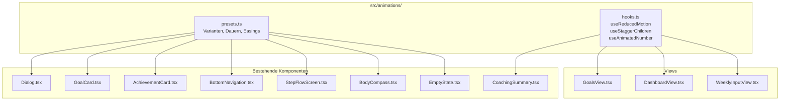
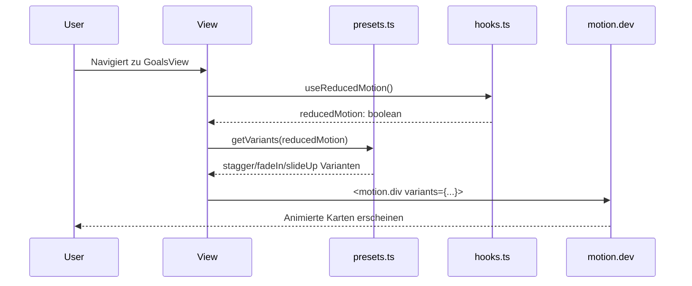

# Design-Dokument: Motion-Animationen

## Übersicht

Dieses Design beschreibt die Integration der `motion.dev`-Bibliothek (v11+, ehemals Framer Motion) in die bestehende React/TypeScript-Fitness-Tracking-PWA. Ziel ist ein zentrales Animations-Modul (`src/animations/`), das wiederverwendbare Presets, Timing-Konstanten und einen `prefers-reduced-motion`-Hook bereitstellt. Die bestehenden Komponenten werden schrittweise um motion-Wrapper ergänzt, ohne die vorhandene DOM-Struktur, CSS-Klassen oder ARIA-Attribute zu verändern.

### Design-Entscheidungen

1. **Zentrales Preset-Modul statt Inline-Konfiguration**: Alle Animations-Varianten, Dauern und Easing-Kurven werden in `src/animations/presets.ts` definiert. Dadurch bleibt die Konsistenz gewahrt und Änderungen wirken global.
2. **`motion`-Komponenten statt CSS-Animationen**: motion.dev bietet deklarative `initial`/`animate`/`exit`-Props, `AnimatePresence` für Exit-Animationen und `layoutId` für Layout-Übergänge — Funktionen, die mit reinem CSS nicht oder nur schwer umsetzbar sind.
3. **Reduced-Motion als globaler Schalter**: Ein Custom-Hook `useReducedMotion()` liest die Media-Query aus und liefert angepasste Presets (Dauer 0, keine Bewegung), die an alle Animations-Komponenten weitergegeben werden.
4. **Keine Wrapper-Komponenten-Explosion**: Statt eigene Wrapper für jede Animation zu bauen, werden die bestehenden `<div>`-Elemente durch `<motion.div>` ersetzt und die Presets direkt als Props übergeben.

## Architektur



### Datenfluss der Animationen



## Komponenten und Schnittstellen

### 1. `src/animations/presets.ts` — Zentrale Animations-Konfiguration

```typescript
// Timing-Konstanten
export const DURATIONS = {
  micro: 0.2,       // Tap-Feedback, Hover
  standard: 0.3,    // Fade-In, Slide-Up
  emphasis: 0.4,    // Zahlen-Animation
  entrance: 0.6,    // Fortschrittsbalken, Seitenübergänge
} as const

export const EASINGS = {
  easeOut: [0.0, 0.0, 0.2, 1.0],
  easeInOut: [0.4, 0.0, 0.2, 1.0],
  spring: { type: 'spring', stiffness: 400, damping: 30 },
  bounce: { type: 'spring', stiffness: 300, damping: 20 },
} as const

export const STAGGER_DELAY = 0.06 // 60ms zwischen Kinder-Elementen

// Varianten-Definitionen
export type AnimationVariants = {
  initial: Record<string, unknown>
  animate: Record<string, unknown>
  exit?: Record<string, unknown>
}

export const fadeIn: AnimationVariants = {
  initial: { opacity: 0 },
  animate: { opacity: 1, transition: { duration: DURATIONS.standard } },
  exit: { opacity: 0, transition: { duration: DURATIONS.micro } },
}

export const slideUp: AnimationVariants = {
  initial: { opacity: 0, y: 20 },
  animate: { opacity: 1, y: 0, transition: { duration: DURATIONS.standard, ease: EASINGS.easeOut } },
  exit: { opacity: 0, y: 20, transition: { duration: DURATIONS.micro } },
}

export const scaleIn: AnimationVariants = {
  initial: { opacity: 0, scale: 0.92 },
  animate: { opacity: 1, scale: 1, transition: { duration: DURATIONS.standard, ease: EASINGS.easeOut } },
  exit: { opacity: 0, scale: 0.92, transition: { duration: DURATIONS.micro } },
}

export const dialogVariants: AnimationVariants = {
  initial: { opacity: 0, y: 40 },
  animate: { opacity: 1, y: 0, transition: { duration: DURATIONS.standard, ease: EASINGS.easeOut } },
  exit: { opacity: 0, y: 40, transition: { duration: DURATIONS.micro, ease: EASINGS.easeInOut } },
}

export const backdropVariants: AnimationVariants = {
  initial: { opacity: 0 },
  animate: { opacity: 1, transition: { duration: DURATIONS.micro } },
  exit: { opacity: 0, transition: { duration: DURATIONS.micro } },
}

export const staggerContainer = {
  animate: { transition: { staggerChildren: STAGGER_DELAY } },
}

export const tapFeedback = {
  whileTap: { scale: 0.97 },
  transition: { duration: DURATIONS.micro },
}

// Reduced-Motion-Varianten: sofortige Zustandsänderung
export const REDUCED_MOTION_VARIANTS: AnimationVariants = {
  initial: { opacity: 0 },
  animate: { opacity: 1, transition: { duration: 0 } },
  exit: { opacity: 0, transition: { duration: 0 } },
}
```

### 2. `src/animations/hooks.ts` — Custom Hooks

```typescript
import { useReducedMotion as useMotionReducedMotion } from 'motion/react'

/**
 * Gibt true zurück, wenn prefers-reduced-motion aktiv ist.
 * Nutzt den eingebauten motion.dev-Hook.
 */
export function useReducedMotion(): boolean {
  return useMotionReducedMotion() ?? false
}

/**
 * Gibt Varianten zurück, die bei reduced-motion sofortige Übergänge verwenden.
 */
export function getVariants(
  variants: AnimationVariants,
  reducedMotion: boolean
): AnimationVariants {
  if (reducedMotion) return REDUCED_MOTION_VARIANTS
  return variants
}

/**
 * Hook für animierte Zahlenwerte.
 * Nutzt motion.dev animate() um von previousValue zu currentValue zu zählen.
 */
export function useAnimatedNumber(
  value: number,
  decimals: number = 1,
  duration: number = DURATIONS.emphasis
): string { ... }
```

### 3. Komponenten-Änderungen (Übersicht)

| Komponente | Änderung | motion.dev-Feature |
|---|---|---|
| `Dialog.tsx` | `<div>` → `<motion.div>` mit `AnimatePresence`, Backdrop + Content Varianten | `AnimatePresence`, `motion.div` |
| `GoalCard.tsx` | Äußeres `<div>` → `<motion.div>` mit `slideUp` + `tapFeedback`, Fortschrittsbalken mit `motion.div` animate width | `motion.div`, `whileTap` |
| `AchievementCard.tsx` | Äußeres `<div>` → `<motion.div>` mit `scaleIn` + `tapFeedback` | `motion.div`, `whileTap` |
| `GoalsView.tsx` | Listen-Container mit `staggerContainer`, `AnimatePresence` für Hinzufügen/Entfernen, `layout`-Prop für Reorder | `AnimatePresence`, `layout` |
| `BottomNavigation.tsx` | Aktiver Indikator mit `layoutId="active-tab"` | `layoutId`, `motion.div` |
| `StepFlowScreen.tsx` | `AnimatePresence` mit richtungsabhängiger Slide-Animation (`mode="wait"`) | `AnimatePresence`, `motion.div` |
| `BodyCompass.tsx` | Zonen-Zeilen mit `staggerContainer` + `fadeIn` | `motion.div` |
| `EmptyState.tsx` | Gestaffelte Fade-In + Slide-Up mit 200ms Initialverzögerung | `motion.div` |
| `CoachingSummary.tsx` | Zahlenwerte mit `useAnimatedNumber` | `animate()` |
| `DashboardView.tsx` | Gewichtswert + Prozentänderung mit `useAnimatedNumber` | `animate()` |


## Datenmodelle

Für die Animations-Integration werden keine neuen persistenten Datenmodelle benötigt. Die Animationen arbeiten ausschließlich mit transienten UI-Zuständen.

### Transiente Zustände

```typescript
/** Richtung der StepFlow-Navigation für Slide-Animation */
type SlideDirection = 'forward' | 'backward'

/** Konfiguration für den useAnimatedNumber-Hook */
interface AnimatedNumberConfig {
  value: number
  decimals?: number    // Default: 1
  duration?: number    // Default: DURATIONS.emphasis (0.4s)
}

/** Presets-Typ für getVariants() */
interface AnimationVariants {
  initial: Record<string, unknown>
  animate: Record<string, unknown>
  exit?: Record<string, unknown>
}
```

### Abhängigkeiten

```
motion (v11+)  →  Neue Abhängigkeit in dependencies
                  Import: import { motion, AnimatePresence } from 'motion/react'
                  Import: import { animate } from 'motion'
```

Keine Änderungen an bestehenden Datenbank-Schemas, IndexedDB-Stores oder Service-Interfaces.


## Correctness Properties

*Eine Property ist eine Eigenschaft oder ein Verhalten, das über alle gültigen Ausführungen eines Systems hinweg gelten sollte — im Wesentlichen eine formale Aussage darüber, was das System tun soll. Properties bilden die Brücke zwischen menschenlesbaren Spezifikationen und maschinell verifizierbaren Korrektheitsgarantien.*

### Property 1: Reduced-Motion erzeugt sofortige Übergänge

*Für jede* exportierte Animations-Variante aus `presets.ts` gilt: Wenn `getVariants(variant, true)` aufgerufen wird (reduced motion aktiv), dann müssen alle `transition.duration`-Werte im zurückgegebenen Objekt exakt `0` sein, sodass keine sichtbare Bewegung stattfindet.

**Validates: Requirements 1.3, 12.2**

### Property 2: Nur GPU-kompatible Eigenschaften werden animiert

*Für jede* exportierte Animations-Variante aus `presets.ts` gilt: Die animierten Eigenschaften in `initial`, `animate` und `exit` dürfen ausschließlich `opacity` und Transform-Eigenschaften (`x`, `y`, `scale`, `rotate`) enthalten. Keine Layout-auslösenden Eigenschaften wie `width`, `height`, `top`, `left`, `margin` oder `padding` dürfen direkt animiert werden.

**Validates: Requirements 12.1**

### Property 3: Animierte Zahlen konvergieren zum Zielwert

*Für jeden* numerischen Wert `n` (im Bereich typischer Messwerte: 0–500) und jede Dezimalstellenanzahl `d` (0–3) gilt: Der `useAnimatedNumber(n, d)`-Hook muss nach Abschluss der Animation den formatierten String `n.toFixed(d)` zurückgeben.

**Validates: Requirements 5.1, 5.2, 5.3**

### Property 4: StepFlow-Slide-Richtung ist konsistent mit Navigationsrichtung

*Für jede* Navigationsrichtung (`forward` oder `backward`) gilt: Die Slide-Varianten müssen den Content in die korrekte Richtung bewegen. Bei `forward` muss `initial.x > 0` (neuer Content kommt von rechts) und `exit.x < 0` (alter Content geht nach links). Bei `backward` muss `initial.x < 0` und `exit.x > 0`. Die Beträge von `initial.x` und `exit.x` müssen identisch sein.

**Validates: Requirements 7.1, 7.2**

## Fehlerbehandlung

### Animations-Fehler

| Szenario | Verhalten |
|---|---|
| motion.dev nicht geladen | Komponenten rendern ohne Animation (graceful degradation durch conditional import) |
| `prefers-reduced-motion` nicht unterstützt | `useReducedMotion()` gibt `false` zurück → Animationen laufen normal |
| Ungültiger Animations-Wert | motion.dev ignoriert ungültige Werte und rendert den Endzustand sofort |
| Komponente unmountet während Animation | `AnimatePresence` handhabt Cleanup automatisch |
| Fortschrittsbalken mit NaN/undefined | Fallback auf 0% — kein Crash, keine Animation |

### Grundsätze

- Animationen sind rein dekorativ — kein Fehler darf den Zugang zu Inhalten blockieren
- Bei jedem Animations-Fehler wird der Endzustand sofort angezeigt (kein hängendes UI)
- Keine try/catch-Blöcke um Animations-Code nötig — motion.dev ist fehlertolerant

## Teststrategie

### Property-Based Tests (fast-check + vitest)

Jede Correctness Property wird als einzelner Property-Based Test mit `fast-check` implementiert. Minimum 100 Iterationen pro Test.

| Test | Property | Beschreibung |
|---|---|---|
| `presets.test.ts` | Property 1 | Generiert zufällige Varianten-Objekte, prüft dass `getVariants(v, true)` immer duration=0 liefert |
| `presets.test.ts` | Property 2 | Iteriert über alle exportierten Varianten, prüft dass nur `opacity`/`x`/`y`/`scale`/`rotate` animiert werden |
| `hooks.test.ts` | Property 3 | Generiert zufällige Zahlen (0–500) und Dezimalstellen (0–3), prüft dass `useAnimatedNumber` zum Zielwert konvergiert |
| `presets.test.ts` | Property 4 | Generiert zufällige Richtungen, prüft dass Slide-Varianten korrekte Vorzeichen haben |

Tag-Format: `Feature: motion-animations, Property {N}: {Beschreibung}`

### Unit Tests (vitest)

Unit Tests decken spezifische Beispiele und Edge Cases ab:

| Test | Beschreibung | Validiert |
|---|---|---|
| `presets.test.ts` | `DURATIONS.micro <= 0.4`, `DURATIONS.entrance <= 0.6` | Req 1.4 |
| `presets.test.ts` | `STAGGER_DELAY` liegt zwischen 0.05 und 0.08 | Req 3.1 |
| `presets.test.ts` | `tapFeedback.whileTap.scale` liegt zwischen 0.97 und 0.98 | Req 6.1 |
| `presets.test.ts` | `dialogVariants.initial` hat `opacity: 0` und `y > 0` | Req 2.1 |
| `presets.test.ts` | `dialogVariants.exit` hat `opacity: 0` und `y > 0` | Req 2.2 |
| `presets.test.ts` | `backdropVariants.initial.opacity === 0` | Req 2.3 |
| `presets.test.ts` | `slideUp.initial` hat `opacity: 0` und `y > 0` | Req 3.3 |
| `presets.test.ts` | `scaleIn.initial` hat `opacity: 0` und `scale < 1` | Req 3.4 |
| `presets.test.ts` | `DURATIONS.emphasis === 0.4` | Req 5.4 |
| `presets.test.ts` | `EASINGS.spring` hat `type: 'spring'` | Req 8.2 |
| `presets.test.ts` | `EASINGS.bounce` hat `type: 'spring'` | Req 9.4 |

### Integrationstests (vitest + @testing-library/react)

| Test | Beschreibung | Validiert |
|---|---|---|
| `Dialog.test.tsx` | Dialog rendert mit `AnimatePresence`, Backdrop und Content | Req 2.1–2.4 |
| `GoalCard.test.tsx` | GoalCard rendert mit motion.div und whileTap | Req 6.1, 6.4 |
| `BottomNavigation.test.tsx` | Aktiver Tab hat `layoutId` | Req 8.1, 8.3 |
| `EmptyState.test.tsx` | EmptyState rendert mit gestaffelter Animation | Req 11.1, 11.2 |

### Konfiguration

- Property-Based Testing Library: `fast-check` (bereits installiert, v4.6.0)
- Test Runner: `vitest` (bereits installiert, v4.1.0)
- Minimum Iterationen: 100 pro Property-Test
- Jeder Property-Test referenziert seine Design-Property im Kommentar
