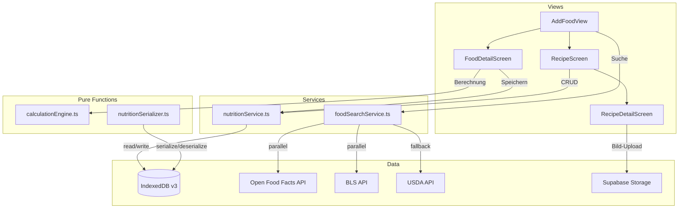

# Design Document: Nutrition Tracking

## Übersicht

Das Nutrition-Tracking-System erweitert die bestehende Fitness-/Gewichtstracking-PWA um eine leichtgewichtige Ernährungserfassung. Der Fokus liegt auf schneller Eingabe (3 Schritte: Suchen → Menge → Speichern), europäischen Lebensmitteldaten (Open Food Facts + BLS) und benutzerdefinierten Rezepten mit Bildvorschau.

Das System besteht aus folgenden Kernkomponenten:
- **Hybride Lebensmittelsuche** über Open Food Facts API (primär), BLS und USDA (Fallback)
- **Calculation Engine** als reine Funktionen für Nährwertberechnung
- **IndexedDB-Stores** für Foods, FoodEntries, Recipes, RecipeItems und Favorites
- **Service Layer** (nutritionService.ts, foodSearchService.ts) nach bestehendem Muster
- **View-Komponenten** integriert in das bestehende Routing und Design-System

## Architektur



### Entscheidungen

1. **IndexedDB v3**: Die DB wird von Version 2 auf 3 migriert. Neue Stores: `foods`, `foodEntries`, `recipes`, `recipeItems`, `favorites`.
2. **Open Food Facts als primäre Quelle**: Kostenlose API, gute DACH-Abdeckung für Markenprodukte. BLS für Basislebensmittel parallel abgefragt.
3. **Calculation Engine als Pure Functions**: Keine Seiteneffekte, einfach testbar. Lebt in `src/utils/calculationEngine.ts`.
4. **Bilder via Supabase Storage**: Rezeptbilder werden als Blob in Supabase Storage hochgeladen, URL im Recipe gespeichert. Kein Base64 in IndexedDB.
5. **Kein eigener Snap-Panel**: Nutrition-Tracking wird als Detail-Route (`/nutrition`, `/nutrition/add`, `/nutrition/recipe/:id`) implementiert, erreichbar über Dashboard oder neuen Nav-Eintrag.

## Komponenten und Schnittstellen

### Views (src/views/)

| Komponente | Datei | Beschreibung |
|---|---|---|
| NutritionView | NutritionView.tsx + .css | Tagesübersicht: Kalorienfortschritt, Makros, Liste der FoodEntries |
| AddFoodView | AddFoodView.tsx + .css | Suchfeld, Tabs (Letzte/Rezepte/Favoriten), Ergebnisliste |
| FoodDetailView | FoodDetailView.tsx + .css | Nährwerte pro 100g, Mengenfeld mit Live-Berechnung, Speichern-Button |
| RecipeListView | RecipeListView.tsx + .css | Grid/Liste gespeicherter Rezepte mit Bildvorschau |
| RecipeDetailView | RecipeDetailView.tsx + .css | Rezept erstellen/bearbeiten: Zutaten suchen, Mengen, Bild, Gesamtnährwerte |

### Services (src/services/)

#### foodSearchService.ts

```typescript
interface FoodSearchResult {
  id: string;
  source: 'openfoodfacts' | 'bls' | 'usda';
  name: string;
  brand?: string;
  kcal_per_100g: number;
  protein_per_100g: number;
  carbs_per_100g: number;
  fat_per_100g: number;
  default_unit: 'g' | 'ml';
}

// Debounced search (300ms) — parallel OFF + BLS, fallback USDA
async function searchFoods(query: string): Promise<FoodSearchResult[]>;

// Einzelne API-Aufrufe (intern)
async function searchOpenFoodFacts(query: string): Promise<FoodSearchResult[]>;
async function searchBLS(query: string): Promise<FoodSearchResult[]>;
async function searchUSDA(query: string): Promise<FoodSearchResult[]>;

// Ergebnisse zusammenführen und nach Relevanz sortieren
function mergeAndRank(
  offResults: FoodSearchResult[],
  blsResults: FoodSearchResult[],
  usdaResults: FoodSearchResult[]
): FoodSearchResult[];
```

#### nutritionService.ts

```typescript
// Food Entries
async function saveFoodEntry(entry: FoodEntry): Promise<void>;
async function getFoodEntriesByDate(date: string): Promise<FoodEntry[]>;
async function deleteFoodEntry(id: string): Promise<void>;
async function getRecentFoods(limit?: number): Promise<Food[]>; // default 20

// Recipes
async function saveRecipe(recipe: Recipe): Promise<void>;
async function getAllRecipes(): Promise<Recipe[]>;
async function getRecipe(id: string): Promise<Recipe | undefined>;
async function deleteRecipe(id: string): Promise<void>;
async function saveRecipeItem(item: RecipeItem): Promise<void>;
async function getRecipeItems(recipeId: string): Promise<RecipeItem[]>;
async function deleteRecipeItem(id: string): Promise<void>;

// Favorites
async function addFavorite(food: Food): Promise<void>;
async function removeFavorite(foodId: string): Promise<void>;
async function getAllFavorites(): Promise<Food[]>;
async function isFavorite(foodId: string): Promise<boolean>;

// Food Cache
async function cacheFood(food: Food): Promise<void>;
async function getCachedFood(id: string): Promise<Food | undefined>;

// Tagesübersicht
async function getDailySummary(date: string): Promise<DailySummary>;
```

### Pure Functions (src/utils/)

#### calculationEngine.ts

```typescript
interface NutritionValues {
  kcal: number;
  protein: number;
  carbs: number;
  fat: number;
}

// Kernberechnung: (wert_pro_100g × gramm / 100), gerundet auf 1 Dezimalstelle
function calculateNutrition(food: Food, amountGrams: number): NutritionValues;

// Portionsgröße → Gramm
function portionToGrams(portionSize: number, portionCount: number): number;

// Rezept-Gesamtnährwerte als Summe aller Items
function calculateRecipeTotals(items: RecipeItemWithNutrition[]): NutritionValues;

// Tagessumme
function calculateDailyTotals(entries: FoodEntry[]): NutritionValues;

// Rundung auf 1 Dezimalstelle
function roundToOneDecimal(value: number): number;
```

#### nutritionSerializer.ts

```typescript
interface NutritionExportData {
  version: 1;
  exportedAt: string;
  foodEntries: FoodEntry[];
  recipes: Recipe[];
  recipeItems: RecipeItem[];
}

function serializeNutrition(data: NutritionExportData): string;
function deserializeNutrition(json: string): NutritionExportData;
function validateNutritionData(data: unknown): data is NutritionExportData;
```


## Datenmodelle

### IndexedDB Schema (Version 3)

Die bestehende `FitnessTrackerDB` in `src/services/db.ts` wird um 5 neue Stores erweitert. Die DB-Version wird von 2 auf 3 erhöht.

```typescript
// Neue Stores in FitnessTrackerDB (Erweiterung des bestehenden DBSchema)

foods: {
  key: string;           // id
  value: Food;
  indexes: {
    'by-source': string; // source
    'by-name': string;   // name
  };
};

foodEntries: {
  key: string;           // id
  value: FoodEntry;
  indexes: {
    'by-date': string;   // date
    'by-food-id': string; // food_id
  };
};

recipes: {
  key: string;           // id
  value: Recipe;
  indexes: {
    'by-name': string;   // name
    'by-created': string; // created_at
  };
};

recipeItems: {
  key: string;           // id
  value: RecipeItem;
  indexes: {
    'by-recipe-id': string; // recipe_id
  };
};

favorites: {
  key: string;           // food_id
  value: Favorite;
  indexes: {
    'by-added': string;  // added_at
  };
};
```

### TypeScript-Typen (Erweiterung von src/types/index.ts)

```typescript
// ─── Nutrition Tracking Types ────────────────────────────────────────

/** Datenquelle eines Lebensmittels */
export type FoodSource = 'openfoodfacts' | 'bls' | 'usda' | 'custom';

/** Normalisiertes Lebensmittel mit Nährwerten pro 100g/100ml */
export interface Food {
  /** Eindeutige ID (Quelle-spezifisch, z.B. OFF Barcode) */
  id: string;
  /** Datenquelle */
  source: FoodSource;
  /** Lebensmittelname */
  name: string;
  /** Markenname (optional, v.a. bei Open Food Facts) */
  brand?: string;
  /** Kalorien pro 100g/100ml */
  kcal_per_100g: number;
  /** Protein pro 100g/100ml */
  protein_per_100g: number;
  /** Kohlenhydrate pro 100g/100ml */
  carbs_per_100g: number;
  /** Fett pro 100g/100ml */
  fat_per_100g: number;
  /** Standard-Einheit */
  default_unit: 'g' | 'ml';
  /** Portionsgröße in Gramm (optional) */
  portion_size_g?: number;
  /** Portionsbezeichnung (optional, z.B. "1 Scheibe") */
  portion_label?: string;
}

/** Ein einzelner Ernährungseintrag für ein Datum */
export interface FoodEntry {
  /** UUID */
  id: string;
  /** Benutzer-ID */
  user_id: string;
  /** Datum (YYYY-MM-DD) */
  date: string;
  /** Referenz auf Food */
  food_id: string;
  /** Lebensmittelname (denormalisiert für schnellen Zugriff) */
  name: string;
  /** Menge in Gramm */
  amount_grams: number;
  /** Berechnete Kalorien */
  kcal: number;
  /** Berechnetes Protein */
  protein: number;
  /** Berechnete Kohlenhydrate */
  carbs: number;
  /** Berechnetes Fett */
  fat: number;
  /** Erstellungszeitpunkt (ISO 8601) */
  created_at: string;
}

/** Benutzerdefiniertes Rezept */
export interface Recipe {
  /** UUID */
  id: string;
  /** Benutzer-ID */
  user_id: string;
  /** Rezeptname */
  name: string;
  /** Bild-URL (Supabase Storage) */
  image_url?: string;
  /** Gesamtkalorien */
  total_kcal: number;
  /** Gesamtprotein */
  total_protein: number;
  /** Gesamtkohlenhydrate */
  total_carbs: number;
  /** Gesamtfett */
  total_fat: number;
  /** Erstellungszeitpunkt (ISO 8601) */
  created_at: string;
}

/** Eine Zutat innerhalb eines Rezepts */
export interface RecipeItem {
  /** UUID */
  id: string;
  /** Referenz auf Recipe */
  recipe_id: string;
  /** Referenz auf Food */
  food_id: string;
  /** Lebensmittelname (denormalisiert) */
  name: string;
  /** Menge in Gramm */
  amount_grams: number;
  /** Berechnete Kalorien */
  kcal: number;
  /** Berechnetes Protein */
  protein: number;
  /** Berechnete Kohlenhydrate */
  carbs: number;
  /** Berechnetes Fett */
  fat: number;
}

/** Favorit (Referenz auf ein Food) */
export interface Favorite {
  /** Food-ID als Key */
  food_id: string;
  /** Vollständiges Food-Objekt (denormalisiert) */
  food: Food;
  /** Zeitpunkt der Markierung (ISO 8601) */
  added_at: string;
}

/** Tagesübersicht mit Summen */
export interface DailySummary {
  /** Datum */
  date: string;
  /** Summe Kalorien */
  total_kcal: number;
  /** Summe Protein */
  total_protein: number;
  /** Summe Kohlenhydrate */
  total_carbs: number;
  /** Summe Fett */
  total_fat: number;
  /** Einzelne Einträge */
  entries: FoodEntry[];
}

/** Nährwert-Export-Format */
export interface NutritionExportData {
  version: 1;
  exportedAt: string;
  foodEntries: FoodEntry[];
  recipes: Recipe[];
  recipeItems: RecipeItem[];
}
```

### DB-Migration (Version 2 → 3)

```typescript
// In db.ts upgrade-Funktion:
if (oldVersion < 3) {
  const foodStore = db.createObjectStore('foods', { keyPath: 'id' });
  foodStore.createIndex('by-source', 'source');
  foodStore.createIndex('by-name', 'name');

  const foodEntryStore = db.createObjectStore('foodEntries', { keyPath: 'id' });
  foodEntryStore.createIndex('by-date', 'date');
  foodEntryStore.createIndex('by-food-id', 'food_id');

  const recipeStore = db.createObjectStore('recipes', { keyPath: 'id' });
  recipeStore.createIndex('by-name', 'name');
  recipeStore.createIndex('by-created', 'created_at');

  const recipeItemStore = db.createObjectStore('recipeItems', { keyPath: 'id' });
  recipeItemStore.createIndex('by-recipe-id', 'recipe_id');

  const favoriteStore = db.createObjectStore('favorites', { keyPath: 'food_id' });
  favoriteStore.createIndex('by-added', 'added_at');
}
```

### Open Food Facts API Integration

Endpunkt: `https://world.openfoodfacts.org/cgi/search.pl`

```typescript
// Beispiel-Request
const params = new URLSearchParams({
  search_terms: query,
  search_simple: '1',
  action: 'process',
  json: '1',
  page_size: '20',
  cc: 'de',           // DACH-Fokus
  lc: 'de',
  fields: 'code,product_name,brands,nutriments',
});

// Response-Mapping auf Food:
function mapOpenFoodFactsProduct(product: OFFProduct): Food {
  return {
    id: `off_${product.code}`,
    source: 'openfoodfacts',
    name: product.product_name,
    brand: product.brands,
    kcal_per_100g: product.nutriments['energy-kcal_100g'] ?? 0,
    protein_per_100g: product.nutriments.proteins_100g ?? 0,
    carbs_per_100g: product.nutriments.carbohydrates_100g ?? 0,
    fat_per_100g: product.nutriments.fat_100g ?? 0,
    default_unit: 'g',
  };
}
```

### Bild-Upload (Supabase Storage)

```typescript
// In nutritionService.ts oder separatem imageService.ts
async function uploadRecipeImage(recipeId: string, file: File): Promise<string> {
  const path = `recipe-images/${recipeId}/${file.name}`;
  const { data, error } = await supabase.storage
    .from('nutrition')
    .upload(path, file, { upsert: true });
  if (error) throw error;
  const { data: urlData } = supabase.storage
    .from('nutrition')
    .getPublicUrl(data.path);
  return urlData.publicUrl;
}
```


## Correctness Properties

*A property is a characteristic or behavior that should hold true across all valid executions of a system — essentially, a formal statement about what the system should do. Properties serve as the bridge between human-readable specifications and machine-verifiable correctness guarantees.*

### Property 1: Nährwertberechnung ist korrekt und gerundet

*For any* Food mit beliebigen Nährwerten pro 100g und *for any* positive Grammangabe (einschließlich Portionsumrechnung), soll `calculateNutrition(food, grams)` für jeden Nährwert das Ergebnis `roundToOneDecimal(wert_pro_100g × grams / 100)` liefern, wobei das Ergebnis maximal eine Dezimalstelle hat.

**Validates: Requirements 3.1, 3.3, 3.5**

### Property 2: Food-Objekt-Vollständigkeit

*For any* Food-Objekt, das von der Suchfunktion zurückgegeben wird, müssen die Felder `id`, `source`, `name`, `kcal_per_100g`, `protein_per_100g`, `carbs_per_100g`, `fat_per_100g` und `default_unit` vorhanden sein, wobei `source` einen der Werte `"openfoodfacts"`, `"bls"` oder `"usda"` haben muss.

**Validates: Requirements 1.3, 1.5**

### Property 3: Suchergebnis-Zusammenführung und Ranking

*For any* zwei Listen von Suchergebnissen aus verschiedenen Quellen (OFF/BLS vs. USDA), soll `mergeAndRank` eine kombinierte Liste erzeugen, die alle Eingabe-Elemente enthält und in der alle BLS- und Open-Food-Facts-Ergebnisse vor allen USDA-Ergebnissen erscheinen.

**Validates: Requirements 1.1, 1.4**

### Property 4: Tagessummen-Berechnung

*For any* Liste von FoodEntries für ein Datum, soll `calculateDailyTotals` für jeden Nährwert (kcal, protein, carbs, fat) die Summe der Einzelwerte aller Einträge zurückgeben, gerundet auf eine Dezimalstelle.

**Validates: Requirements 4.5**

### Property 5: Rezept-Gesamtnährwerte

*For any* Liste von RecipeItems, soll `calculateRecipeTotals` für jeden Nährwert die Summe der Einzelwerte aller Items zurückgeben, gerundet auf eine Dezimalstelle.

**Validates: Requirements 5.3**

### Property 6: Persistierte Nährwerte stimmen mit Berechnung überein

*For any* Food und *for any* positive Grammangabe, wenn ein FoodEntry gespeichert wird, sollen die im Entry persistierten Werte (kcal, protein, carbs, fat) exakt mit dem Ergebnis von `calculateNutrition(food, amount_grams)` übereinstimmen.

**Validates: Requirements 4.3**

### Property 7: Rezept als Tageseintrag

*For any* Recipe mit berechneten Gesamtnährwerten, wenn das Rezept als FoodEntry zum Tageseintrag hinzugefügt wird, sollen die Nährwerte des FoodEntry exakt mit den Gesamtnährwerten des Rezepts übereinstimmen.

**Validates: Requirements 5.6**

### Property 8: Letzte Einträge — Begrenzung und Reihenfolge

*For any* Sequenz von gespeicherten FoodEntries, soll `getRecentFoods` maximal 20 Einträge zurückgeben, sortiert nach `created_at` absteigend, und jedes zuletzt gespeicherte Lebensmittel muss in der Liste enthalten sein (sofern die Liste nicht voll ist mit neueren Einträgen).

**Validates: Requirements 4.4, 7.4**

### Property 9: Favoriten Round-Trip

*For any* Food-Objekt, wenn es als Favorit markiert wird (`addFavorite`), soll `getAllFavorites` dieses Food-Objekt enthalten, und nach `removeFavorite` soll es nicht mehr enthalten sein.

**Validates: Requirements 7.1**

### Property 10: Food-Cache Round-Trip

*For any* Food-Objekt, wenn es über `cacheFood` zwischengespeichert wird, soll `getCachedFood(id)` ein äquivalentes Objekt zurückgeben.

**Validates: Requirements 8.3**

### Property 11: Serialisierung Round-Trip

*For any* gültige NutritionExportData (mit beliebigen FoodEntries, Recipes und RecipeItems), soll `deserializeNutrition(serializeNutrition(data))` ein äquivalentes Objekt erzeugen, und `serializeNutrition(deserializeNutrition(serializeNutrition(data)))` soll einen identischen JSON-String wie `serializeNutrition(data)` erzeugen.

**Validates: Requirements 9.1, 9.2, 9.3**

### Property 12: Ungültige JSON-Daten erzeugen Fehlermeldung

*For any* String, der kein gültiges NutritionExportData-JSON darstellt, soll `deserializeNutrition` einen Error mit einer beschreibenden Fehlermeldung werfen.

**Validates: Requirements 9.4**

## Fehlerbehandlung

| Szenario | Verhalten |
|---|---|
| Open Food Facts API nicht erreichbar | Nur BLS-Ergebnisse anzeigen, kein Fehler für den Benutzer |
| Alle APIs nicht erreichbar | Hinweis "Keine Verbindung — nur lokale Daten verfügbar", lokaler Cache und Favoriten bleiben nutzbar |
| Ungültige Nährwertdaten von API | Felder auf 0 setzen, Lebensmittel trotzdem anzeigen mit Warnung |
| Bild-Upload fehlgeschlagen | Rezept ohne Bild speichern, Fehlermeldung anzeigen, Retry ermöglichen |
| IndexedDB-Schreibfehler | Error-Toast anzeigen, Operation nicht still verschlucken |
| Ungültige Grammangabe (≤ 0, NaN) | Berechnung nicht ausführen, Eingabefeld als ungültig markieren |
| JSON-Import ungültig | Beschreibende Fehlermeldung mit Hinweis auf das Problem (z.B. "Feld 'date' fehlt bei Eintrag 3") |
| Doppelte Food-IDs beim Merge | Deduplizierung nach ID, erste Quelle (BLS/OFF) gewinnt |

## Testing-Strategie

### Property-Based Testing

- **Library**: [fast-check](https://github.com/dubzzz/fast-check) (TypeScript-native, gut integriert mit Vitest)
- **Konfiguration**: Mindestens 100 Iterationen pro Property-Test
- **Tag-Format**: `Feature: nutrition-tracking, Property {number}: {title}`

Jede Correctness Property (1–12) wird als einzelner Property-Based Test implementiert:

| Property | Testdatei | Generator |
|---|---|---|
| 1: Nährwertberechnung | calculationEngine.property.test.ts | Arbitrary Food + positive number |
| 2: Food-Vollständigkeit | foodSearchService.property.test.ts | Arbitrary API responses |
| 3: Merge & Ranking | foodSearchService.property.test.ts | Arbitrary result lists with mixed sources |
| 4: Tagessummen | calculationEngine.property.test.ts | Arbitrary FoodEntry[] |
| 5: Rezept-Summen | calculationEngine.property.test.ts | Arbitrary RecipeItem[] |
| 6: Persistierte Werte | nutritionService.property.test.ts | Arbitrary Food + grams |
| 7: Rezept als Entry | nutritionService.property.test.ts | Arbitrary Recipe |
| 8: Letzte Einträge | nutritionService.property.test.ts | Arbitrary FoodEntry sequences |
| 9: Favoriten Round-Trip | nutritionService.property.test.ts | Arbitrary Food |
| 10: Cache Round-Trip | nutritionService.property.test.ts | Arbitrary Food |
| 11: Serialisierung Round-Trip | nutritionSerializer.property.test.ts | Arbitrary NutritionExportData |
| 12: Ungültige JSON | nutritionSerializer.property.test.ts | Arbitrary invalid strings |

### Unit Tests

Unit Tests ergänzen die Property Tests für spezifische Beispiele und Edge Cases:

- **calculationEngine.test.ts**: Bekannte Lebensmittel mit erwarteten Werten (z.B. 250g Hähnchenbrust = 412.5 kcal), Grenzwerte (0g, sehr große Mengen), Rundungsbeispiele
- **foodSearchService.test.ts**: Mock-API-Responses, Fallback-Verhalten bei leeren Ergebnissen, Fehlerbehandlung bei API-Timeout
- **nutritionService.test.ts**: CRUD-Operationen, Datumsfilterung, Favoriten-Toggle
- **nutritionSerializer.test.ts**: Spezifische ungültige JSON-Formate, fehlende Felder, falsche Typen
- **Komponenten-Tests**: AddFoodView rendert alle Abschnitte, FoodDetailView zeigt Live-Berechnung, RecipeScreen zeigt Platzhalter ohne Bild

### Teststruktur

```
src/
  utils/
    calculationEngine.ts
    calculationEngine.test.ts
    calculationEngine.property.test.ts
    nutritionSerializer.ts
    nutritionSerializer.test.ts
    nutritionSerializer.property.test.ts
  services/
    nutritionService.ts
    nutritionService.test.ts
    nutritionService.property.test.ts
    foodSearchService.ts
    foodSearchService.test.ts
    foodSearchService.property.test.ts
```
