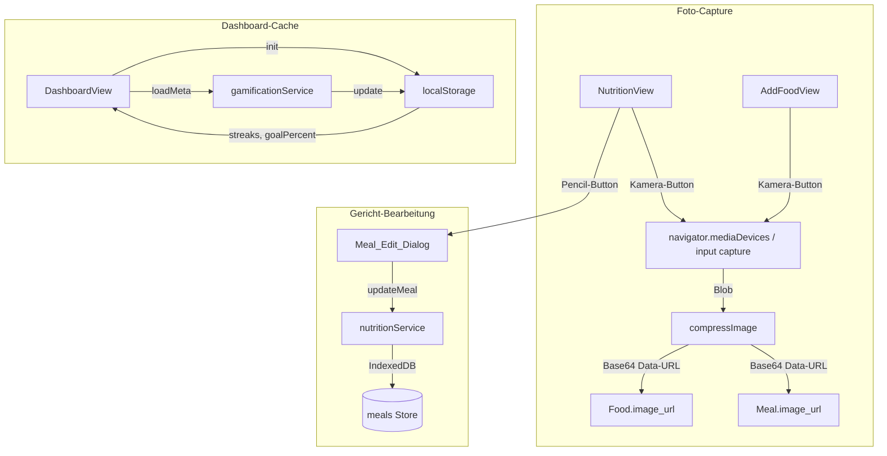

# Design Document: UI-Polish, Foto-Capture & Dashboard-Optimierung

## Übersicht

Nachträgliche UI-Verbesserungen an der bestehenden Fitness-Tracker-PWA. Betrifft drei Bereiche:

1. **Foto-Capture & Gericht-Bearbeitung** — Kamera-Integration für Gerichte und eigene Lebensmittel, Bildkomprimierung, Edit-Dialog
2. **Messungs-View Restrukturierung** — Aufteilung der kombinierten Gewicht/Körperfett-Card in separate Cards
3. **Dashboard-Stabilität** — Sofortiges Rendering ohne Layout-Jump, localStorage-Caching für Badges

## Architektur



### Entscheidungen

1. **Base64 Data-URL statt Supabase Storage**: Fotos werden als komprimierte Base64-Strings direkt im IndexedDB-Meal/Food-Objekt gespeichert. Vermeidet Netzwerk-Abhängigkeit und vereinfacht Offline-Nutzung. Die Komprimierung auf max. 150KB hält die DB-Größe vertretbar.
2. **`compressImage()` als Utility**: Zentrale Komprimierungsfunktion in `src/utils/imageCompression.ts`. Nutzt Canvas API für Resize und JPEG-Komprimierung.
3. **`mode`-Prop für DailyInputView**: Statt zwei separate Komponenten zu erstellen, steuert ein `mode`-Prop welche Felder angezeigt werden. Minimale Änderung, maximale Wiederverwendung.
4. **localStorage-Cache für Dashboard-Badges**: Streak- und Goal-Daten werden nach jedem `loadMeta` in localStorage geschrieben und beim Mount daraus initialisiert. Verhindert Flackern bei Cmd+R.
5. **`updateMeal()` statt `updateMealName()`**: Generische Update-Funktion die beliebige Felder (name, image_url) akzeptiert. Ersetzt die spezifische `updateMealName()`.

## Komponenten und Schnittstellen

### Neue Utility: Image Compression

**Datei:** `src/utils/imageCompression.ts`

```typescript
/**
 * Komprimiert ein Bild auf max. 150KB, 800px Breite, JPEG-Format.
 * Gibt eine Base64 Data-URL zurück.
 */
export async function compressImage(file: File | Blob): Promise<string>;
```

Algorithmus:
1. Bild in `Image`-Element laden
2. Canvas erstellen, auf max. 800px Breite skalieren (Aspect Ratio beibehalten)
3. `canvas.toDataURL('image/jpeg', quality)` mit absteigender Quality (0.8 → 0.5 → 0.3) bis Ergebnis ≤ 150KB
4. Base64 Data-URL zurückgeben

### Geänderte Services

**nutritionService.ts — updateMeal:**

```typescript
// Ersetzt updateMealName()
async function updateMeal(
  id: string,
  updates: { name?: string; image_url?: string | null }
): Promise<void>;
```

**nutritionService.ts — createMeal (erweitert):**

```typescript
// Akzeptiert jetzt optionale image_url
async function createMeal(date: string, name: string, image_url?: string): Promise<Meal>;
```

**nutritionService.ts — createCustomFood (erweitert):**

```typescript
// Akzeptiert jetzt optionale image_url
async function createCustomFood(food: Omit<Food, 'id'> & { image_url?: string }): Promise<Food>;
```

### Geänderte Views

**MeasurementView.tsx:**
- 3 separate Cards statt 1 kombinierte
- Gewicht-Card → öffnet DailyInputView mit `mode="weight"`
- Körperfett-Card → öffnet DailyInputView mit `mode="bodyFat"`, Subtitle "Optionale Messung", Percent-Icon
- Umfang-Card → öffnet WeeklyInputView (unverändert)

**DailyInputView.tsx:**
- Neuer Prop: `mode?: 'weight' | 'bodyFat' | 'both'` (Default: `'both'`)
- Rendert nur die zum Mode passenden Felder

**DashboardView.tsx:**
- `streaks` initialisiert aus `localStorage.getItem('dashboard-streaks')` statt `null`
- `goalPercent` initialisiert aus `localStorage.getItem('dashboard-goalPercent')` statt `null`
- Nach `loadMeta`: Werte in localStorage schreiben
- Value-Display immer gerendert (mit 0 als Fallback), kein bedingtes Rendering
- Inaktive Time-Range-Buttons: `data-material="transparent"`
- Inaktive Circumference-Buttons: `data-material="transparent"`

**NutritionView.tsx:**
- `<h1>Ernährung</h1>` am oberen Rand
- Gericht-Erstellung: Input + Camera-iconOnly-Button in einer Zeile, OK full-width primary darunter, Abbrechen darunter
- Gericht-Card: Thumbnail im Header (4rem × 4rem), `role="button" tabIndex={0}`, Enter/Space-Handler
- Edit-Dialog: Name-Input + Foto mit "Foto ändern" / X-Buttons
- Zutaten-Einträge: `className="adaptive" data-material="semi-transparent"`
- Innerer Löschen-Button: `data-material="transparent"`
- "+ Zutaten" statt "Hinzufügen"

## Datenmodelle

### Erweiterte Typen

Keine neuen Typen. Bestehende Typen erweitert:

- `Meal.image_url?: string` — bereits im Nutrition-Tracking-Spec als optional definiert, wird jetzt aktiv genutzt
- `Food.image_url?: string` — für eigene Lebensmittel mit Foto

### localStorage Keys

| Key | Typ | Beschreibung |
|---|---|---|
| `dashboard-streaks` | `JSON<Streaks>` | Gecachte Streak-Daten für sofortiges Rendering |
| `dashboard-goalPercent` | `JSON<number \| null>` | Gecachter Goal-Fortschritt in Prozent |

## Correctness Properties

### Property 1: Bildkomprimierung erzeugt gültiges JPEG ≤ 150KB

*For any* Bild-Blob beliebiger Größe, soll `compressImage(blob)` einen Base64-String zurückgeben, der mit `data:image/jpeg` beginnt und dessen decodierte Größe ≤ 150KB beträgt.

**Validates: Requirements 1.3, 2.2**

### Property 2: Meal-Update Round-Trip

*For any* Meal mit beliebigem Namen und optionalem Foto, wenn `updateMeal(id, { name, image_url })` aufgerufen wird, soll das anschließend gelesene Meal die aktualisierten Werte enthalten.

**Validates: Requirements 3.4**

### Property 3: DailyInputView Mode-Filterung

*For any* Mode-Wert (`'weight' | 'bodyFat' | 'both'`), soll die DailyInputView genau die zum Mode passenden Felder rendern: `'weight'` → nur Gewicht, `'bodyFat'` → nur Körperfett, `'both'` → beide.

**Validates: Requirements 4.3, 4.4, 4.5**

### Property 4: Dashboard-Cache Konsistenz

*For any* Streaks-Objekt, wenn es in localStorage geschrieben und anschließend gelesen wird, soll das Ergebnis identisch mit dem Original sein.

**Validates: Requirements 5.3, 5.4**

## Fehlerbehandlung

| Szenario | Verhalten |
|---|---|
| Kamera nicht verfügbar | Kamera-Button verstecken oder deaktivieren, kein Fehler |
| Bildkomprimierung schlägt fehl | Gericht/Lebensmittel ohne Bild speichern, Fehlermeldung anzeigen |
| localStorage nicht verfügbar | Dashboard funktioniert normal, Badges laden erst nach async loadMeta |
| updateMeal mit ungültiger ID | Fehler loggen, UI nicht aktualisieren |
| Foto-Entfernung | `image_url` auf `null` setzen, Thumbnail verschwindet |

## Testing-Strategie

Da alle Änderungen bereits implementiert und manuell getestet sind, werden keine neuen automatisierten Tests hinzugefügt. Die bestehenden 332 Tests decken die Kernlogik ab. Zukünftige Änderungen an `compressImage` oder `updateMeal` sollten Unit-Tests erhalten.
